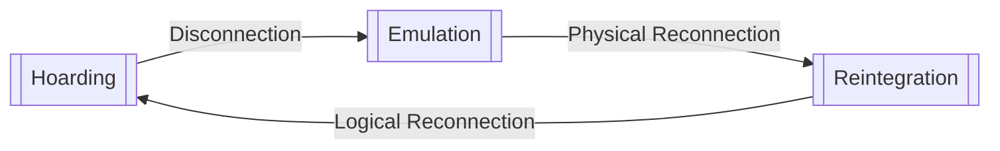

---
tags:
  - CSE_223B
---
# Overview
The primary contribution of **CodaFS** is that *caching of data* (primarily used for performance) can be exploited to improve [[Networked File Systems#Definition (High Availability)|availability]]. It builds on top of [[Networked File Systems|NFS]], mitigating file system failures. 

CodaFS allows access to an NFS while disconnected. Actions made during this state are called **disconnected operations**, a temporary deviation from normal operation as a client of a shared repository. 
- Designed for 1-2 days of disconnect.
- Optimized for access and sharing, not for highly concurrent, fine-granularity data access.
- Clients see Coda as a single, location-transparent, shared Unix file system. 
- The entire namespace is mapped to individual file servers at the granularity of subtrees called **volumes**.
- At each client, a **cache manager** (Venus) dynamically obtains cached volume mappings. 
- **Server replication** is used for better access.
	- **Volume Storage Group (VSG)**: set of replicated sites.
	- **Accessible VSG (AVSG)**: subset of what the client can access.
	- When a cached copy is no longer valid, the notification to do so is called a **callback break**. ^3ce6c6
- Cache [[Memory Coherence#Definition (Memory Coherence)|coherence]] protocol is based on *callbacks*, ensuring an open file is the latest copy in the AVSG.
	- Modifications propagate through all AVSG sites, then VSG sites. 
- Involuntary disconnects are functionally the same as voluntary disconnects.

When the AVSG is empty, disconnected operation begins. Venus services file system requests via its cache. Cache misses cannot be serviced nor masked, so to the user, they are reported as failures. When disconnection ends, Venus propagates modifications and reverts to server replication. 

# Design Principles
## Replication Hierarchy
First Class (Server Replication):
- More persistent
- Widely known
- Secure
- Available
Think of them as good public utilities.

Second Class (Cache Copies):
- Cache copies on clients
- Inferior among all above
- Periodic revalidation to 1st class makes 2nd class useful

Cache coherence combines the performance and scalability advantages of 2nd class with the quality of 1st class. 

[[Replication]]:
- Preserves quality of data. 
- Expensive hardware-wise.

Disconnected operation:
- Forsakes quality for availability.
- Cheap.
- Can be exclusively relied upon.

## Replica Control
Pessimistic:
- Avoids conflicting operations by disallowing all partitioned writes or by restricting reads/writes to a single partition.
- Client needs to acquire exclusive control.
	- Allows reading at other clients, but writes are forbidden everywhere.
	- Voluntary disconnects = easy, involuntary = hard.
- Retaining control is acceptable on brief disconnects, but on extended periods, the entire user community is at the mercy of a single errant client for an unbounded amount of time.
- Uses **leases** to set a time bound for exclusive/shared control.
	- Defeats the purpose of disconnected operation.
	- Updates during disconnect would need to be discarded.

Optimistic:
- Higher availability by allowing reads/writes everywhere.
- Conflicts will happen, either disconnect-server or disconnect-disconnect.
- Deals with conflicts by detecting and resolving them after their occurrence.
	- Manual resolution violates transparency (the seamless integration of high availability into a normal Unix environment).
	- Annoying, reduces usability.

CodaFS chose optimistic replica control because: ^0d7f29
- They believed writes were rare.
- It provides a uniform model of the system from the user's perspective.

## Whole-File Caching
A cache miss can only occur on an `open`, never on a `read`, `write`, `seek`, or `close`. This substantially simplifies the implementation of disconnected operation. On `write`, the clients gets a **LSID** (local store ID). It is 
```
<name of server that accepted write, lamport clock at that server>
```
It is the preferential server the client wants to connect to. Each server has a Coda version vector, which is the most recent LSID it has received from each other server to learn about writes from other servers.

## Avoidance of System-Wide Rapid Change
They rejected strategies that require election or [[Consensus|agreement]] by large numbers of nodes.

# Client Structure
Venus is a user-level process because of its complexity. Venus intercepts Unix calls via the Sun Vnode interface. Since this interface is slow, it talks to the **MiniCache** which filters out many kernel-Venus interactions. The MiniCache services the syscall (if possible). Otherwise, it delegates it to Venus and control is returned to the application (which may contact other Coda servers).

```tikz
\usepackage{tikz}

\begin{document}
\begin{tikzpicture}[>=stealth, font=\sffamily, thick]

% --- 1. Background/Kernel Box ---
\draw (0.5, 0.5) rectangle (9.5, 5.0);
\draw (0.5, 4.4) -- (9.5, 4.4);
\node at (5, 4.7) {System Call Interface};

% --- 2. Application and Venus Boxes (Top Level) ---
\node[draw, fill=white, rounded corners=12pt, minimum width=2.4cm, minimum height=4.0cm, align=center] (app) at (1.8, 7.0) {Application};
\node[draw, fill=white, rounded corners=12pt, minimum width=3.6cm, minimum height=3.0cm, align=center] (venus) at (7.0, 6.5) {Venus};

% --- 3. Kernel Nodes ---
\node[draw, fill=white, minimum width=3.2cm, minimum height=0.6cm, inner sep=3pt] (vnode) at (2.5, 3.2) {Vnode Interface};
\node[draw, fill=white, minimum width=3.5cm, minimum height=0.8cm, inner sep=3pt] (minicache) at (6.5, 1.5) {Coda MiniCache};

% --- 4. Left Side Arrows (Application -> Vnode -> MiniCache) ---
% Downward arrow (App -> Vnode)
\draw[->] ([xshift=0.3cm]app.south) -- ([xshift=-0.4cm]vnode.north);

% Downward arrow (Vnode -> MiniCache)
\draw[->] ([xshift=0.5cm]vnode.south) -- ([xshift=-1.2cm]minicache.north);

% --- 5. Right Side Arrows (Venus <-> MiniCache) ---
% Downward arrow (left side, bulging left)
\draw[->] ([xshift=-0.5cm]venus.south) to[bend right=15] ([xshift=-0.5cm]minicache.north);
% Upward arrow (right side, bulging right)
\draw[->] ([xshift=0.5cm]minicache.north) to[bend right=15] ([xshift=0.5cm]venus.south);

% --- 6. External Network Arrow ---
\draw[->] (venus.east) -- ++(1.5,0) node[right, align=center, font=\sffamily\itshape] {to Coda\\servers};

\end{tikzpicture}
\end{document}
```

Venus operates in three states:
- Hoarding
- Emulation
- Reintegration


Venus is normally in the hoarding state, relying on [[#Replication Hierarchy|replication]] but always on alert for possible disconnection. Upon reconnection, it reintegrates, updating the AVSG, then reverts to hoarding when done. 

A client can connect to any server, but it needs to be at least one.

## Hoarding
The key responsibility of Venus is to hoard useful data in anticipation of disconnection. It also needs to manage its cache to balance the needs of connected and disconnected operations. Many factors complicate implementation:
- File reference behavior
- Disconnections and reconnections are unpredictable
- The true cost of a cache miss while disconnected is highly variable 
- Activity at other clients must be accounted for
- Cache space is finite, so it may have to sacrifice less critical objects

A per-workstation **hoard database (HDB)** is used to identify files of interest. A **hoard profile** is used to determine which files are stored. **Hoard priority** is used to determine the priority of certain objects. All ancestors of an object will also be cached (like a directory). 

We say a cache is in **equilibrium** when the user can expect their cache to be available, and no uncached object has a higher priority than a cached object (may be disturbed as a result of normal activity). Venus periodically restores equilibrium via an operation known as **hoard walking**. 
- Portable machines mean the user is better at augmenting cache management for disconnected operation.
- Occurs every 10 minutes.
- Can be requested on voluntary disconnection.
- Phase 1: Name bindings of HDB entries are reevaluated to reflect update activity at other clients.
	- New children may have been created in a directory whose pathname is specified with the `+` option in the HDB. 
- Phase 2: Priorities of all entries in the cache and HDB are reevaluated, and objects are fetched/evicted to restore equilibrium.
- Hoard walks address [[#^3ce6c6|callback breaks]].
	- In traditional callback-based caching, data is refetched on demand after a callback break. 
	- In Coda, this may result in a critical object being unavailable should disconnection occur before the next reference to it.
	- Refetching immediately solves this problem, but ignores how objects are typically modified many more times in a short interval. 
	- Thus, immediate refetching would increase traffic, reducing scalability. 
	- Coda balances availability, consistency, and scalability by purging and refetching either on demand or during the next hoard walk, whichever occurs earlier.
	- Directories are not purged, but *marked suspicious*. 

## Emulation
This occurs on disconnect. Venus performs many actions normally handled by servers. It generates temporary **file identifiers (fids)**[^1] for new objects, pending assignment of permanent fids on reintegration. Cache management is done with the same priority algorithm during [[#Hoarding]]. Cache entries of deleted objects are freed immediately, but modified objects get infinite priority to ensure deletion does not happen.  ^b0fc4c

[^1]: It is `<name of the server, lamport clock at server>`.

Venus keeps a **replay log** to replay update activity on reintegration. During a `write` and `close`, since Venus uses [[#Whole-File Caching]], it installs a completely new copy of a file, storing a single `store` record in the log. Venus discards previous `store` records when a new one is appended because all previous versions of a file are superfluous (they are overwritten). It merely points to the copy in the cache. 

On disconnect, the user must be able to restart (clearing RAM) without losing data, so the data must persist to disk. Venus stores metadata:
- Cached objects of all types, logs, and the HDB are stored in **recoverable virtual memory (RVM)**.
- The actual content is stored on disk; only metadata is in RVM.
Transactions are used to manipulate metadata (operations have a clearly defined start and end, so we never leave the system in an incoherent state). 

## Reintegration
This is when the client reconnects. Venus needs to replay the log and the server log to catch up its AVSG. 

First, the system propagates changes by:
1. Venus obtains permanent fids for new objects and uses them to replace temporary fids in the replay log. 
	1. This is typically avoided in many cases since Venus obtains a small set of permanent fids in advance during [[#Hoarding]].
2. The replay log is shipped in parallel to the AVSG, and executed independently by each member. Each server performs the replay within a single transaction (to ensure coherence) and aborts if any error is detected. 

Then, it executes the replay algorithm by:
1. The log is parsed, a transaction is begun, and all objects referenced in the log are locked. ^2470da
2. Each operation in the log is validated and then executed. ^335b24
	1. Validation consists of conflict [[#Replica Control|detection]], integrity protection, and disk space checks. Except for `store` operations, execution during replay is identical to execution in connected mode. 
	2. For a `store`, an empty *shadow file* is created, and metadata is updated to reference it, but transfer is deferred. 
3. Data transfer is done for `store`. This is known as **back-fetching**. 
4. The transaction commits, and the [[#^2470da|locks]] are released.

If reintegration succeeds, the replay log is freed and the [[#^b0fc4c|priority of cached objects]] is reset.

### Conflict Handling
The use of [[#^0d7f29|optimistic]] replica control means that we can have conflicts with other disconnected clients. In particular, more care needs to be taken for `write`/`write` conflicts. Each replica of an object is tagged with a **storeid** that uniquely identifies the last update to it. During [[#^335b24|phase two]] of replay, a server compares the storeid of every object mentioned in a log entry with the storeid of its own replica of the object. 

If comparison indicates equality for all objects, the operation is performed and the mutated objects are tagged with a new storeid specified in the log entry. 

If the storeid comparison fails, the action taken depends on the operation being validated:
- In the case of a `store` of a file, the entire reintegration is aborted. 
- For directories, a conflict is declared only if a newly created name collides with an existing name.
	- If an object updated at the client or the server has been deleted by the other.
	- If directory attributes have been modified at the server and the client.
