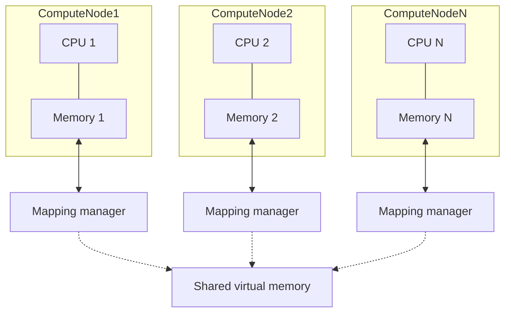
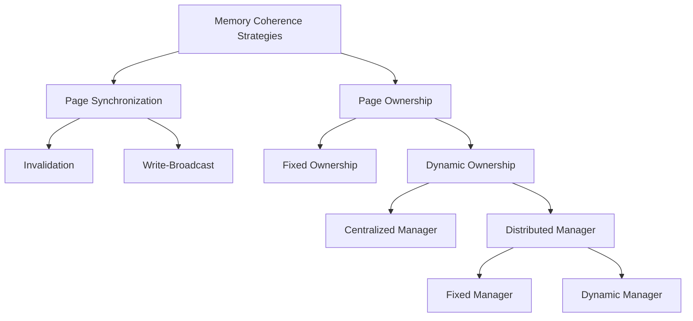

---
tags:
  - CSE_223B
---
Based on [paper](https://dl.acm.org/doi/pdf/10.1145/75104.75105). The goal is to implement shared virtual memory on loosely coupled multiprocessors. 

# Definition (Memory Coherence)
A memory is **coherent** if the value of a memory location is the same for all processors at any given time. In other words, the value returned by a read operation is always as the value written by the most recent write operation to that location. 

An architecture with one memory access path has no coherence problem. (Single computer, single threaded/single processor).

# Definition (Shared Virtual Memory)
**Shared virtual memory** is a shared memory abstraction that allows processes running on different processors to access the same virtual memory address space. The idea is to allow processes to run on different processors in parallel. 
- Data can *migrate* between processors on demand
- Natural and efficient form of *process migration* between processors in a distributed system.
- Memory mapping managers implement the mapping between local memory and shared virtual memory. The chief responsibility is to maintain coherence.

The main difficulty is solving the **memory coherence problem**: how to maintain a consistent view of memory across all processors.

There are two design choices that influence the implementation of shared virtual memory:
- Granularity of the memory units (page size)
  - Larger page size means less overhead for maintaining coherence, but higher chance for contention.
  - Smaller pages means more overhead for maintaining coherence, but lower chance for contention.
- Coherence Strategy.

# Definition (Locality of Reference)
**Locality of reference** is the principle that programs tend to access a relatively small portion of their address space at any given time. This is a key principle that allows for efficient caching and memory management. There are two types of locality:
- *Temporal locality*: If a program accesses a memory location, it is likely to access the same location again in the near future.
- *Spatial locality*: If a program accesses a memory location, it is likely to access nearby locations in the near future.

# Memory Coherence Strategies
Strategies are classified by how they deal with page synchronization and page ownership.

## Page Synchronization 
There are two strategies: invalidation and write-broadcast. 

In **invalidation** there is only one owner processor for each page. The processor has either write or read access to the page. If a processor $Q$ has a write fault (wants to write to a page it does not own), to a page $p$, its fault handler then 
1. invalidates all copies of $p$ on other processors (if any)
2. changes the access of $p$ to $Q$ to write access.
3. moves a copy of $p$ to $Q$ if necessary.
4. returns control to $Q$.

$Q$ can then write to $p$ and proceed. If $Q$ as a read fault (wants to read a page it does not own), the handler
1. changes the access of $p$ to read on the processor that has write access to $p$
2. moves a copy of $p$ to $Q$ if necessary and sets the access of $p$ to read on $Q$.
3. returns control to $Q$.

$Q$ can then read from $p$ and proceed.

In **write-broadcast**, there a processor treats a read fault just like in the invalidation strategy. However, if $Q$ has a write fault, the handler
1. writes to all copies of the page
2. returns control to $Q$.

The main problem with this is it requires special hardware support. Every write to a shared page needs to generate a fault on the writing processor to update all copies of the page.

> In 1989, there was no such hardware support.

## Page Ownership
The ownership of a page can be fixed or dynamic. In a **fixed ownership** strategy, each page is assigned to a specific processor. The owner processor is responsible for maintaining the coherence of the page. 
- other processors cannot write to the page without going through the owner processor, which can lead to bottlenecks.
- constrains desired modes of parallel execution

In a **dynamic ownership** strategy, the ownership of a page can change over time. The owner processor is responsible for maintaining the coherence of the page while it owns it. There are two further types of dynamic ownership strategies: centralized and distributed. Distributed managers can be further classified as fixed or dyanmic. 

| Page Sync Method | Fixed          | Dynamic: Centralized Manager | Dynamic: Distributed Manager (Fixed) | Dynamic: Distributed Manager (Dynamic) |
| :--------------- | :------------- | :--------------------------- | :----------------------------------- | :------------------------------------- |
| Invalidation     | Not allowed    | Okay                         | Good                                 | Good                                   |
| Write-broadcast  | Very expensive | Very expensive               | Very expensive                       | Very expensive                         |
# Definition (Memory Consistency)
**Memory Consistency** focuses on the apparent ordering of reads and writes across *multiple, different memory addresses* as observed by different processors. This is different from [[#Definition (Memory Coherence)|memory coherence]] as the view is of multiple processors. 

The scope is much larger