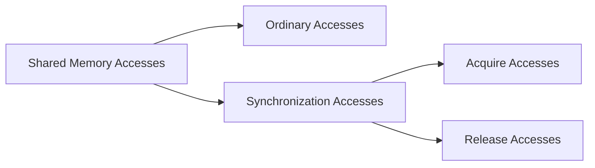

---
tags:
  - CSE_223B
---
Based on [paper](https://cseweb.ucsd.edu/classes/sp11/cse223b/papers/keleher94.pdf). TreadMarks is a [[Memory Coherence#Definition (Shared Virtual Memory)|distributed shared memory (DSM)]] system for Unix systems. TreadMarks reduces the amount of communication performed to maintain [[Memory Coherence#Definition (Memory Consistency)|memory consistency]] via **lazy release consistency (LRC)**. 

# Release Consistent Memory Model
**Release consistency (RC)** is a *relaxed* memory consistency model that permits a processor to delay making its changes to shared data visible to other processors until certain synchronization accesses occur. Shared memory accesses are categorized as either *ordinary* or *synchronization* accesses. Synchronization accesses are further categorized as either *acquire* or *release* accesses.

Acquire and release accesses correspond to the synchronization primitives of locks, but other mechanisms can be implemented on top of it as well. 

## Sequentially Consistent (SC) Memory
In a sequentially consistent memory model, modifications to shared memory must become visible to all processors immediately. Programs written for SC produce the same results on RC memory provided that 
1. all synchronization operations use system-provided synchronization primitives, and
2. there is a release-acquire pair between conflicting accesses to shared memory.

However, RC can be implemented more efficiently. The requirement that shared memory updates must become visible to all processors immediately is *relaxed*.

# Lazy Release Consistency (LRC)
**Lazy release consistency (LRC)** is a memory consistency model that further relaxes the requirements of [[#Release Consistent Memory Model|RC]] by postponing the propagation of shared memory updates until the time of the acquire. 

LRC divides the execution into *intervals*, denoted by the *interval index*. Each time a process executes a `release` or `acquire` operation, a new interval begins and the interval index is incremented. Intervals are [[Partial Order|partially ordered]] by the *happens-before* relation.

This works by giving each node their own [[Vector Timestamps]], which are updated at each acquire. When a node acquires a lock, it needs to update everything based on the ordering of its own vector timestamp. At each time the acquire node is lower, it needs to update. 
- Potentially expensive. The node may need to talk to every other node to update.
- However, it only needs to talk to the node with the most recent acquire, since they already updated. So just talk to them (sufficient).
- You can get the current data from anywhere else (why would you want this?)
	- The node might be geographically closer.
	- Possible you may get a message that has lower time -> just ignore them, they are out of date.
	- Not entirely clear how you can calculate this, but you have the **freedom** to decide.
- Could have many events/updates the node does care about. LRC says they need to be updated, but the node could ignore them because they do not need them.

How do we know which pages to update? In TM, these pages would be invalidated. At each acquire, TM receives a set of *write notices* from the node that released the lock. These write notices are the pages that changed since the last acquire.

What happens when a node has a page fault?
- can ask the node that last recently held the lock
- can ask any other node with the most recent page

The key idea is that in TM, we do not need to keep all copies of pages at all points in time. Instead, we can be *lazy* and only create diffs when necessary by taking snapshots at the time of the release.

There is the possibility the node may have written before or after the lock. If they wrote before the lock, then they will be included in the write notice. If they wrote after the lock, then they will not be included in the write notice, but they will be included in the next release. The new node can just collapse these changes into theirs.

> Being lazy is important for efficiency, but it is less fault tolerant. 

# Implementation 
- `PageArray`: Array with one entry for each page. Each entry contains 
	- current state: `no access`, `read only`, or `read/write`
	- approximate copyset: set of processors that are believed to have a copy of the page.
	- for each page, an array indexed by processor of head/tail pointers to a linked list of *write notice* records for that page. 
- `ProcArray`: Array with one entry for each processor
- Set of interval records, mainly the [[Vector Timestamps]] for each interval.
- Set of *write notices* for each interval.

