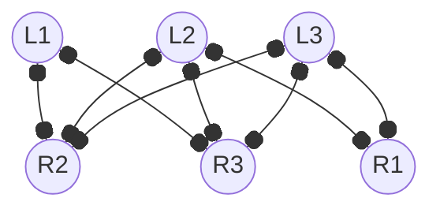
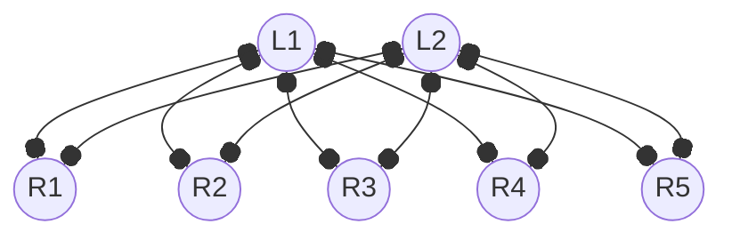

---
tags:
  - MATH_154
---
# Definition (Bipartite Graph)
A **bipartite graph** $V$ is a [[Graph]] that partitions a left $L$ and right $R$ side. Indeed, $V = L \cup R$. 
- $L \cap R = \varnothing$. 
- All edges connect a vertex in $L$ to a vertex in $R$. 

## Formal
We want a way to define a bipartite graph without having to rearrange the vertices when drawing them. In particular, we want to (further) formalize the definition. 

A graph is **bipartite** if we can color vertices white and black such that each edge connects a white vertex to a black vertex. 

# Definition (Complete Bipartite Graph)
Denoted as $K_{a,b}$ a **complete bipartite graph** denotes a graph where $|L| = a$ and $|R| = b$. Every vertex on the left has an edge to the right side and vice versa.  

The [[Degree]] of $K_{a,b}$ is equal to $ab$. 