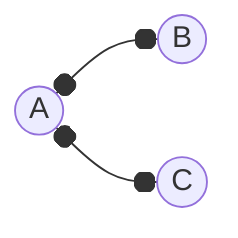
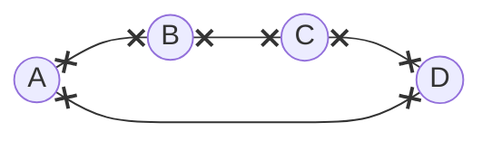
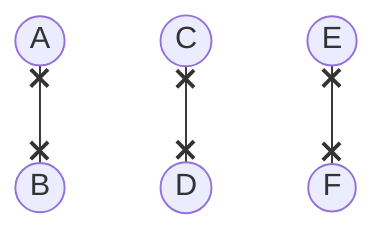

---
tags:
  - MATH_154
---
# Definition
The **degree** of a vertex $v$ denoted as $\deg(v)$ is the number of edges that $v$ is [[Graph#Definition Incident Vertex|incident]] on. 

Here, $\deg(A) = 2$ and $\deg(B) = \deg(C) = 1$. 

# Definition: $d-$regular
A [[Graph]] $G$ is **$d-$regular** if all vertices have degree $d$. We can also say that that $G$ is just **regular**. 

For example:

is $0-$regular, 

is $2-$regular, 

is $1-$regular. 

## Limitations
Some graphs you cannot draw. For example, there is no $3-$regular graph with $5$ vertices. 

# Definition (Minimum Degree of a Graph)
Let 
$$
\delta(G) = \min_{v \in V} \deg(v)
$$ 
denote the minimum degree of any vertex $v \in V$ for [[Graph]] $G$. 