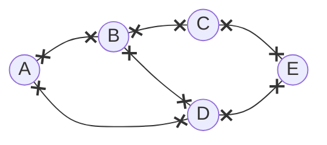

---
tags:
  - MATH_154
---
# Definition
A **graph** $G$ is a tuple $(V, E)$ where 
- $V$ is a set of **vertices**
- $E$ is a set of **edges** connecting two vertices. Formally, it is a set of *unordered pairs* of elements of $V$.

# Vertices
**Vertices** are a set of items or objects that represent a node on a graph. 

## Definition: Adjacent Vertices
Two **vertices** are **adjacent** if there is an edge connecting them. 

## Definition: Incident Vertex
A vertex $v$ is **incident** on an edge $e$ if $v$ is one of the vertices by $e$. This literally just means the vertex(or vertices, see [[Hypergraph]]) that compose an edge. 
## Definition: Vertex Neighborhood
The **neighborhood** of a vertex $v$ is the set of adjacent vertices. An *open* neighborhood *does not* include $v$. A *closed* one does. Indeed, 
$$
v \not\in N(v)
\quad\quad\quad
v \in \ovl{N(v)}
$$
where $N(v)$ is the set of adjacent vertices on $v$. 
