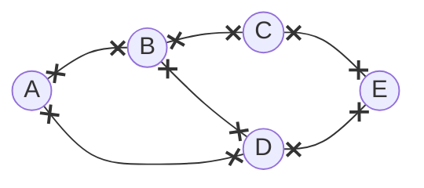

---
tags:
  - MATH_158
---
# Definition
A **graph** $G$ is a tuple $(V, E)$ where 
- $V$ is a set of **vertices**
- $E$ is a set of **edges** connecting two vertices. Formally, it is a set of *unordered pairs* of elements of $V$.

Mermaid:

