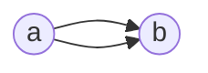

---
tags:
  - MATH_158
---
# Definition 
A **multigraph** is a [[Graph]] where there are multiple edges between the same pair of vertices. 

```mermaid
graph LR
    a((a)) --> v2((b));
    a((a)) --> v2((b));
```

