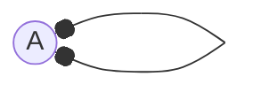

---
tags:
  - MATH_154
---
# Definition
A [[Graph]] with self-loops. That is, a graph where the vertex pair that makes an edge is itself. For example,

> Mermaid has poor support for self loops so they look like this. See [this](https://github.com/mermaid-js/mermaid/issues/6336) to check if it's been fixed yet.

