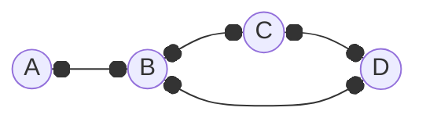
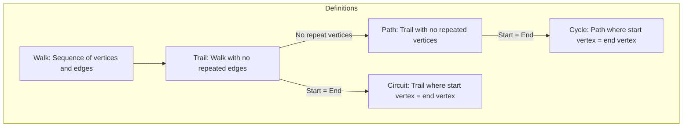

---
tags:
  - MATH_154
---
# Definition (Walk)
A **walk** is a sequence of vertices
$$
v_{1}, v_{2}, \dots v_{n}
$$
such that 
$$
(v_{1}, v_{2}), (v_{2}, v_{3}), \dots (v_{n-1}, v_{n}) \in E
$$
that traverses the sequence of vertices.  
- You can revisit vertices and edges. 
- The list of vertices need not be all vertices of $G$.
- Walks do not have to be finite. However, for this class they will be. 

# Definition (Trail)
A **trail** is a walk with no repeated edges. We can still repeat vertices, but not edges. 

where $A, B, C, D, B$ is a trail. 

## Definition (Circuit)
A **circuit** is a trail that starts and ends at the same vertex. The [[Path]] version of this is a [[Cycle]].

# Lemma (Walk to Path)
If $G$ has a walk from $u$ to $v$, then it has a path from $u$ to $v$. You are essentially "removing the efficiencies" in this walk until it becomes a path. 

