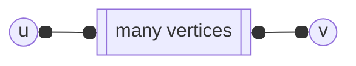
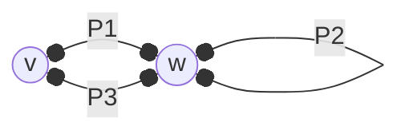
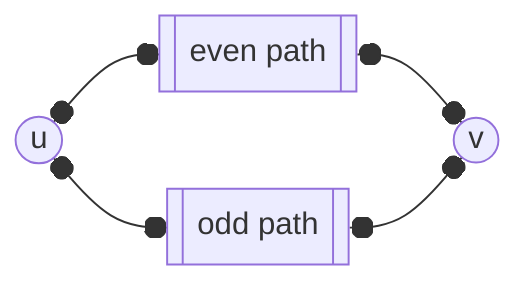

---
tags:
  - MATH_154
---
# Definition (Reachability)
We say vertex $u$ is **reachable** from $v$ if there is a [[Walk]] from $v$ to $u$. 

# Theorem (Connected Components)
For any $G$, you can partition vertices into its **connected components** such that given $u,v \in V$, $u$ is reachable from $v$ if it is in the same connected component. 

Proof:
This proof comes from the idea that connectivity is an *equivalence relation*. 
1. $v$ is reachable from $v$, so it is reflexive
2. if $u$ is from reachable from $v$, then $v$ is reachable from $u$, so it is symmetric. 
3. If $u$ is reachable from $v$, and $v$ to $w$, then there is a walk from $u$ to $w$, and thus reachable. It is transitive. 

Thus, we can say that each connected component is an *equivalence class*. This gives us a formal way to partition $V$ into equivalence classes, such that $u,v$ are related iff they are in the same class. 

# Lemma (Odd Loops, Odd Cycle)
If $G$ has a loop of odd length, it has a [[Cycle|cycle]] of odd length. 

Proof:
If there are no repeated vertices, then it is automatically a cycle. Suppose not.
Consider 

where $P\{1, 2, 3\}$ are walks and $w$ is our repeated vertex. We have two loops, $P2$ and $P1,P3$. Since $|P1| + |P2| + |P3|$ is odd, either at least one is odd or all are odd. If $P2$ is odd, we can repeat the process and obtain an odd cycle. 

If the sole odd walk is $P1$ xor $P2$, we are done. 

> We use loop here to mean "a walk that starts and ends at the same vertex, but may repeat edges/vertices."

# Theorem (Bipartite Cycles)
[[Graph]] $G$ is [[Bipartite Graph#Formal|bipartite]] iff it contains no odd length [[Cycle]]. 

Proof:
$(\implies)$
Suppose we have some cycle of length $n$ that is odd, such that $v_{1}, v_{2}, \dots, v_{n}, v_{1}$ is our cycle. WLOG, if $v_{1}$ is white, $v_{2}$ is black. In general, all odd vertices are white, and all even vertices are black. But then $v_{n}$ is odd and so it is white. But then our edge $(v_{n}, v_{1})$ is invalid (white to white), and so it cannot be bipartite. 

$(\impliedby)$ 
WTS that 
$$
\text{no odd cycles } \implies \text{bipartite}
$$
Assume $G$ is [[#Theorem (Connected Components)|connected]] and has no odd cycles. Pick some vertex $v$ in this partition. We pick another $w$ in this partition, and as it is connected there exists a $v-w$ [[Walk]] $P$. If $|P|$ is even, then let $w$ be white. If $|P|$ is odd, let $w$ be black. 

We can have many $v-w$ [[Path|paths]]. I claim that all paths will have even length or odd length. Suppose by contradiction that we have two walks, one with even and odd path. 

But then we have a *loop* of odd length as $\text{odd} + \text{even} = \text{odd}$. Note that this is a loop because the odd path may use some of the vertices in the even path. 

Using [[#Lemma (Odd Loops, Odd Cycle)]], the odd path gives us an odd cycle. But this contradicts the premise that we have no odd cycles, and so all paths must be even or odd. 

So if all paths from $v$ to $w$ are even, color $v$ white. We need to show that any $(u, w)$ edge, it must have different colors. WLOG, we color $w$ white if any $v-w$ path is even, and $w$ black if any path $v-w$ is odd. 

Let $P_{u}$ be the $v-u$ path. Now consider path $P_{u} + (u, w)$, of length $|P_{u}| + 1$. If $|P_{u}|$ was odd, then $|P_{u}| + 1$ is even, then $w$ is black, and $u$ is white, and vice versa. 

Since $u$ is arbitrary, every edge has different coloring, and the graph is [[Bipartite Graph|bipartite]]. 

If $G$ is not connected then we can split it to its connected components and repeat the process. Then each connected component is bipartite. 