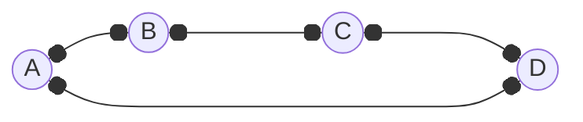

---
tags:
  - MATH_154
---
# Definition
It is a [[Graph]] where the edges form a circle. That is, if we follow ever edge, we should return at the starting node. 
- If vertices $v_{1}, v_{2}, \dots, v_{n}$ then the edges are $(v_{1}, v_{2}), (v_{2}, v_{3}), \dots, (v_{n-1}, v_{n}), (v_{n}, v_{1})$. 
- They are always $2-$[[Degree#Definition $d-$regular|regular]]. 
- $|E|  = 2n/2 = n$ 

- It is a [[Walk]] that starts and ends at the same vertex, but does not repeat vertices. 