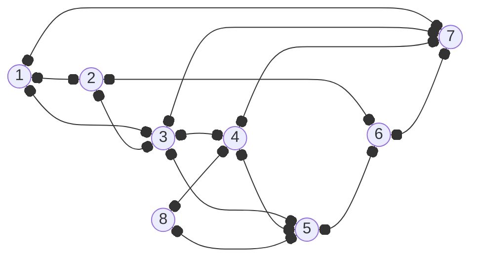
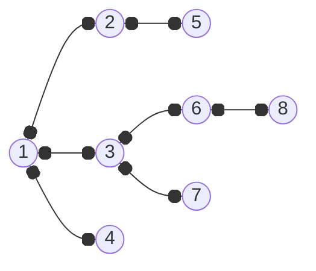
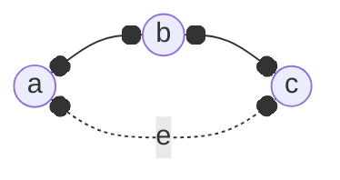

---
tags:
  - MATH_154
---
# Definition (Breadth First Search)
**Breadth First Search (BFS)** connects each new vertex to the oldest possible option. This is the opposite of [[Depth First Search]]. The BFS tree creates a wide graph. Using the same example,

we get the BFS to be

This generated by $1 \to 2, 1 \to 3, 1 \to 4$. Then since we visited $2$ the earliest (and thus the oldest visited), we have $2 \to 5$. Backtracking, $\color{red} 5 \to 2 \to 1$ and then $1 \to 3 \to 6$, and so on.

# Lemma (BFS Has No Ancestor Edges)
No ancestor edges are in the edges since they're all cousins.

Proof:
We always connect to older vertices.

Here, we will always go for $a$ to $b$, and then always take $e$. 

# Theorem (BFS Gives Shortest Path)
If you run BFS starting from vertex $v$ to get tree $T$, then the path from $v \to w$ for any other vertex $w$ in $T$ is the shortest path between $v,w$. 

Proof:

Fix $v \in V$. Let $d(v, w)$ be the *true shortest path* length (minimum number of edges) from $v$ to $w$ in the graph $G$, where 
$$
d(u, v) = \begin{cases}
\min \{ |P| : P \text{ is a path from } u \text{ to } v \text{ in } G \} & \text{if } u \neq v \\
0 & \text{if } u = v \\
\infty & \text{if no path exists}
\end{cases}
$$
Then let $\dist(v, w)$ be the *tree path* length from $u$ to $v$ generated by BFS tree $T$. This is also the "level" that $w$ is in (relative to $v$).

I claim that for any vertex $w \in G, d(v, w) = \dist(v, w)$. We prove this by strong induction on $k = d(v, w)$. 

Base Cases: Let $k = 0$. Then $d(v, w) = 0$ iff $w = v$. The BFS algorithm starts at $v$, at level $0$ of $T$, so $d(v, v) = \dist(v, v)$ holds.

Inductive Hypothesis: Assume that for all $k \leq n$ for some $n \geq 0$, the claim holds. That is, if $d(v, u) = k \leq n$ then $\dist(v, u) = k$. 

Let $k = n + 1$. We need to show that this claim holds for any vertex $w$ where $d(v, w) = n + 1$. Then we have some path $P$ where 
$$
P : v \to \cdots u \to w 
$$
Since $d(v, w) = n + 1$, then $d(v, u) = n$. By the induction hypothesis, $\dist(v, u) = n$. Thus, when BFS reaches $u$, it considers its neighbors. When BFS sees $w$, if $w$ is unvisited, then we set $u$ as $w$'s parent, and $\dist(v, w) = n + 1$. If $w$ is already visited, then some other node $u'$ visited at some other level. 

Suppose by contradiction that $w$ was visited earlier, such that $\dist(v, w) \leq n$. But then by the Induction Hypothesis, $d(v, w) \leq n$. But this is a contradiction, since we assumed $d(v, w) = n + 1$. Therefore $w$ is visited after $u$, and cannot be visited from a previous vertex. Thus $\dist(v, w) = n + 1 = d(v, w)$. 