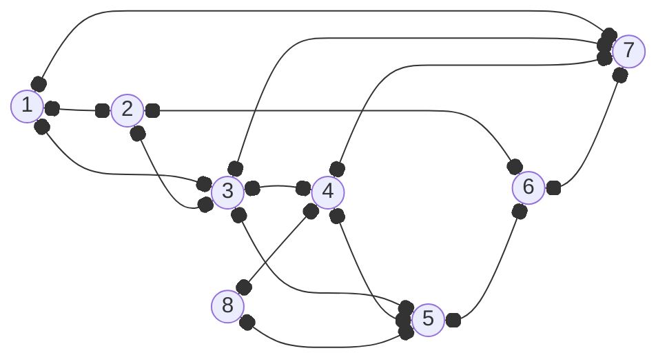
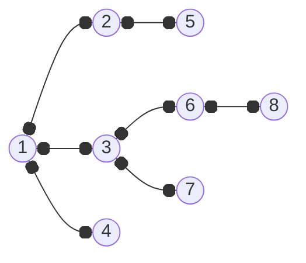
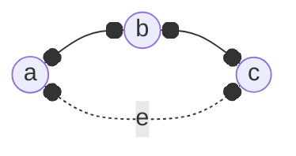

---
tags:
  - MATH_154
---
# Definition (Breadth First Search)
**Breadth First Search (BFS)** connects each new vertex to the oldest possible option. This is the opposite of [[Depth First Search]]. The BFS tree creates a wide graph. Using the same example,

we get the BFS to be

This generated by $1 \to 2, 1 \to 3, 1 \to 4$. Then since we visited $2$ the earliest (and thus the oldest visited), we have $2 \to 5$. Backtracking, $\color{red} 5 \to 2 \to 1$ and then $1 \to 3 \to 6$, and so on.

# Lemma (BFS Has No Ancestor Edges)
No ancestor edges are in the edges since they're all cousins.

Proof:
We always connect to older vertices.

Here, we will always go for $a$ to $b$, and then always take $e$. 

# Theorem (BFS Gives Shortest Path)
If you run BFS starting from vertex $v$ to get tree $T$, then the path from $v \to w$ for any other vertex $w$ in $T$ is the shortest path between $v,w$. 

Proof:
By strong induction on $n$, the $n$th vertex connected in $v$ by BFS is connected by a shortest path and in increasing order of distance.

Base Case: $n = 1$ when $v = v$. 
Inductive Step: Consider vertex $n$. Suppose $n$ connects to $m$. 
- We know $n$ does not connect to $1, 2, \dots, m - 1$,
- that $v \to m$ is the shortest. 
Path $v \to n$ has one more edge than $v \to m$. 
- $\text{dist}(v \to n) = \text{dist}(v \to m) + 1$ 
So, we get the path 
$$
P : v \to \dots \to m \to n
$$
By the inductive hypothesis, we know $v \to m$ is the shortest path to $m$, denoted as $d(v, m)$. The total length of $P$ is $d(v, m) + 1$. 

Suppose by contradiction there was a better path to $v \to n$. It would have to go from 
$$
P' : v \to \dots \to y \to n
$$
with $\text{length}(P')$. We know the path from $v \to y$ here is $\text{length}(P') - 1$. The true shortest distance $d(v, y)$ must be
$$
d(v, y) \leq \text{length}(P') - 1
$$
In particular, our assumption that we have a shorter path means we are assuming
$$
\text{length}(P') < d(v, m) + 1
$$
which implies 
$$
d(v, y) \leq \text{length}(P') - 1 < d(v, m)
$$
such that 
$$
d(v, y) < d(v, m)
$$
But then by definition of BFS, this means we discovered $y$ at an earlier layer than $m$. But as $n$ is a neighbor of $y$, BFS would have discovered $n$, establishing $y$ as the parent, giving us a contradiction on the fact that $n$ was found through $m$. 