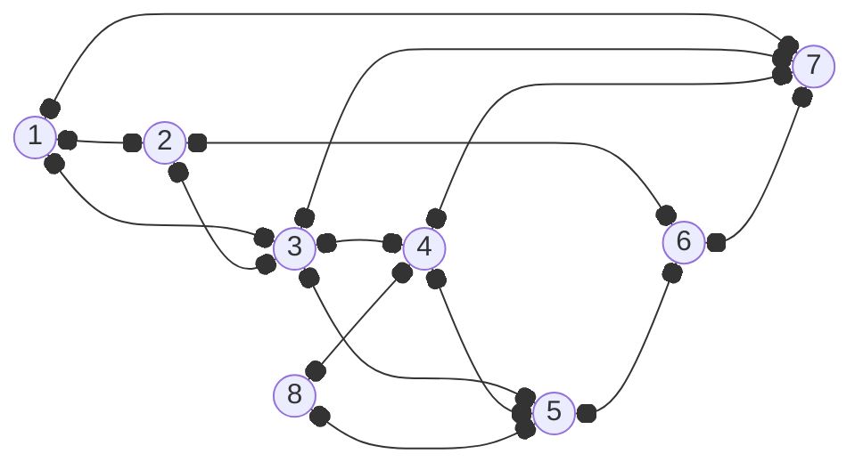
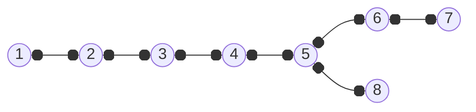
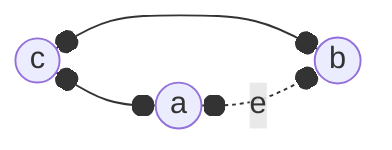

---
tags:
  - MATH_154
---
# Method (Depth First Search)
**Depth First Search (DFS)** keeps a list of vertices connected so far in order. It connects a new vertex to the most recent possible option. 

It also allows us to create a [[Tree#Definition (Spanning Tree)|spanning tree]] of a graph. For example, 

which, follows $v \to 2 \to 3 \to 4 \to 5 \to 6 \to 7$. But then it needs to backtrack since we cannot reach $8$. Thus, we go from $\color{red}7 \to 6 \to 5$ and then $5 \to 8$. This gives a new tree:

In general, DFS trees create long skinny graphs. 

# Lemma (DFS Trees Connect Ancestors)
In a DFS tree, all other edges of $G$ connect ancestors.

Proof:
Instead of an ancestor, you can have a cousin:

where $c$ is some common ancestor and some edge $e$ that connects $a$ and $b$. But this cannot happen with DFS. This is because we will not connect $c$ to anything new until all of $a$'s neighbors have been added. So we must explore $e$ once we finish exploring $a$'s children.  

