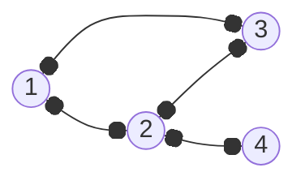
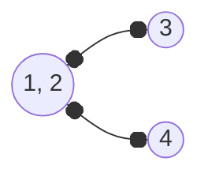

---
tags:
  - MATH_154
aliases:
  - MST
  - minimum spanning tree
---
# Definition (Minimum Spanning Tree)
Given graph $G$ with [[Weighted Graph|weight]] function $w : E \to \R$, we want the spanning tree $T$ where 
$$
\sum_{e \in E} w(e)
$$
is as small as possible. 
# Lemma (Constructing MST by Lightest Edge)
If $G$ is a finite [[Weighted Graph|weighted]] [[Connectivity|connected]] graph, and $e$ is the minimum weight edge of $G$, then $G$ has a [[Tree#Definition (Minimum Spanning Tree)|MST]] containing edge $e$. 

In fact, if $e$ is the unique lightest edge, then all MSTs contain $e$. 

Proof (1):
Let $G$ be a weighted, connected graph and let $e = (u, v)$ be an edge with the minimum weight in $G$. Let $T$ be any MST of $G$. 

If $e \in T$, the lemma holds and we are done. 

If $e \not\in T$, then we can find a new spanning tree $T'$ where $e \in T'$ and $w(T') \leq w(T)$. If $T$ was minimal, then so is $T'$. 

Then if we add $e$ to $T$, then as $u,v$ were already connected (by definition of a [[Tree]]), this creates a [[Cycle|cycle]] $C_{e}$, and so we no longer have a tree. Cycle $C_{e}$ must have some other edge $e' \neq e$ where 
$$
w(e) \leq w(e')
$$
and
$$
T' = T \cup \{e\} - \{e'\}
$$
This $T'$ is a spanning tree. We know $T \cup \{e\}$ is connected. If we remove $e'$ from $C_{e}$ then we still have a connected graph. In particular, this shows $T'$ is a connected graph. *But*, 
$$
|E(T')| = |E(T)| = |V| - 1
$$
then we must have no cycles by [[Tree#Lemma (Tree Edge Count)]]. Therefore, $T'$ is a tree. 

Now we can work with $T'$. Next,
$$
w(T') = w(T) - w(e') + w(e)
$$
But then 
$$
\begin{aligned}
w(e) \leq  w(e')
&\iff w(e) - w(e') \leq 0 \\
&\iff w(T') \leq w(T)
\end{aligned}
$$
But then $T$ was already an MST, then $T'$ must also be an MST.

If $e$ was the unique lightest edge, then $w(e) < w(x)$ for any other edge $x \neq e$. Then strictly,
$$
w(T') < w(T)
$$
indeed, all MSTs must contain $e$. 

# Graph Contraction 
We can construct a new graph by taking a subset $W \subseteq V(G)$ and replacing it with a singular vertex $w$. Then we take the edges incident on the vertices of $W$ and replace them with $w$. For example, 

which when contracted with $W = \{1, 2\}$, we get 

In particular to MST construction, when we add an edge $e = (u, v)$ to our MST, we can treat $u, v$ as the same vertex, *combining* the previous vertices of the edge. We can repeat our construction by selecting the lightest *remaining* edge in [[#Lemma (Constructing MST by Lightest Edge)|lemma]]. 

Where *remaining* means an edge that does not form a cycle. 