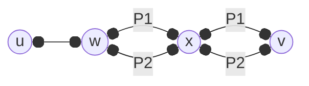
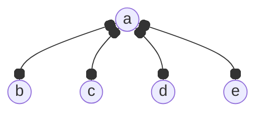
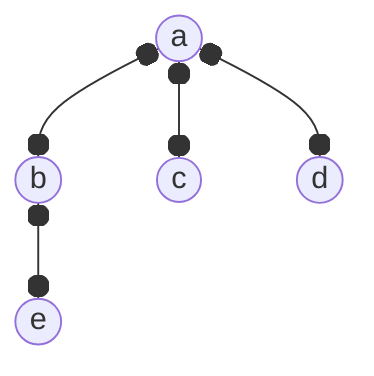
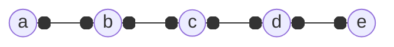
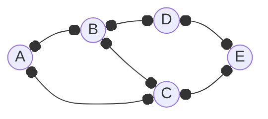
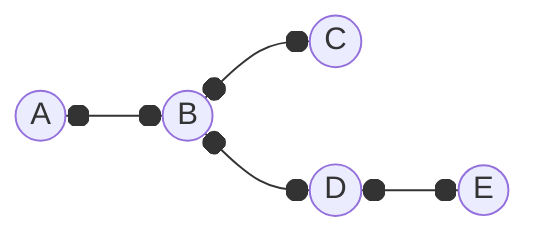

---
tags:
  - MATH_154
---
# Definition (Tree)
A **tree** is a [[Connectivity|connected]] [[Graph]] with no [[Cycle|cycles]]. 

# Definition (Forest)
A **forest** is a [[Graph]] with no [[Cycle|cycles]], where each connected component is a tree. 

# Lemma (Trees have Unique Paths)
If $T$ is a tree with $u, v$ as vertices, then there is a unique [[Path|path]] from $u$ to $v$. 

Proof:
$T$ is connected, so there is a path from $u$ to $v$. Suppose by contradiction there were two different paths $P_{1}, P_{2}$. Suppose $P_{1},  P_{2}$ are isomorphic up to some vertex $w$. From this vertex, the paths may be unique up to some point $x$ (in which $x$ can be $v$). But then as we have a path from $P_{2}$ from $w \to x$  and path $P_{1}$ from $w \to x$, then we have a cycle, a contradiction. 

# Trees with $5$ Vertices
We do this based on maximum degree of a vertex. 

or 

or

But we see that no matter what, there are $4$ edges.

# Lemma (Tree Edge Count)
For any tree $T = (V, E)$, 
$$
|E| = |V| - 1
$$
Intuitively, we build a tree by adding $1$ edge at a time. Let $n$ be the number of vertices of this tree. For each edge $e$ connecting $u,v$ we add, one of two things happen:
1. we decrease the number of [[Connectivity#Theorem (Connected Components)|connected components (CCs)]] by $1$
2. it stays the same, but $e$ is now part of a [[Cycle|cycle]].

**Case 1:** If $u, v$ are not in the same CC, then given $e$, we can now have a path from one CC to another CC. But then these vertices are now connected, thus reducing one. 

**Case 2:** If $u,v$ is in the same CC, then the number of connected components do not change. But as there is already a path from $u,v$, adding $e$ means we can have another unique path from $u,v$, creating a cycle. 

Let $c(G)$ denote the number of connected components. We prove a more *general* lemma and show equality after. I claim 
$$
c(G) \geq |V| - |E|
$$
and that 
$$
c(G) = |V| - |E|
$$
iff $G$ has no cycles. 

Proof: 
By induction on $|E|$. If $|E| = 0$ then $|V| = c(G)$. For equality, we have no cycles and that
$$
\begin{aligned}
c(G) &= |V| - |E| \\
|V| &= |V| - 0 \\
\end{aligned}
$$
so we are done. 

Assume that for all $G$ with $|E| = m$, this is true. We want to prove for $G$ where $|E| = m + 1$. Suppose we remove some edge $e = (u, v)$ in $G$ to get $m$ edges. Label this graph $G' = (E', V)$. By the induction hypothesis, we have that 
$$
c(G') \geq |V| - |E'| = |V| - m
$$
Suppose we add back this edge. We have two cases:

**Case 1:** If $e$ connects $2$ different CCs, then they merge into a single CC. Therefore $c(G) = c(G') - 1$. So,
$$
\begin{aligned}
c(G) + 1 &\geq |V| - m \\ 
c(G) &\geq |V| - (m + 1) \\ 
c(G) &\geq |V| - |E|
\end{aligned}
$$
which is our hypothesis. If $G$ was a forest, then each CC would have no cycle such that 
$$
\begin{aligned}
c(G) + 1 &= |V| - m \\
c(G) &= |V| - (m + 1) \\ 
c(G) &= |V| - |E|
\end{aligned}
$$
which is our equality case. 

**Case 2:** If $e$ does not connect CCs, then $u,v$ are in the same CC. In particular, $c(G) = c(G')$. So,
$$
\begin{aligned}
c(G') &\geq |V| - m \\ 
c(G) &\geq |V| - (|E| - 1) \\
c(G) &\geq |V| - |E| + 1  \\
c(G) & > |V| - |E|
\end{aligned}
$$
Indeed, this shows th inequality and the contrapositive of the equality. 

Since trees have no cycles and only $1$ CC, then $|E| = |V| - 1$. 

# Definition (Leaf)
In a tree $T$, a **leaf** is a vertex of degree $1$. 

# Lemma (Minimum Leaves)
Any (finite) tree on $n > 1$ vertices has at least $2$ leaves. 

Proof:
Let $T$ be some tree with $n$ vertices. By the [[Handshake Lemma]] and [[#Lemma (Tree Edge Count)]], 
$$
\sum_{v\in V} \deg(v) = 2|E| = 2(n - 1)
$$
Then since the leaves have only degree $1$, we can count the degrees of the leaves. 
$$
\begin{aligned}
\sum_{v\in V} 2 - \deg(v) 
&= \sum_{v \in V} 2 - \sum_{v \in V} \deg(v) \\ 
&= 2n - 2(n - 1) \\
&= 2
\end{aligned}
$$
But then
$$
\leq \sum_{v \in V}
\begin{cases}
1 & v \text{ is a leaf} \\
0 & \text{otherwise}
\end{cases}
$$

# Definition (Spanning Tree)
If $G$ is a [[Graph]], a **spanning tree** of $G$ is a [[Graph#Definition (Subgraph)|subgraph]] $T$ that is a tree and has the same vertex set. 

with the spanning tree:

# Theorem (Connected Graphs Have a Spanning Tree)
Every (finite) connected graph $G$ has a [[#Definition (Spanning Tree)|spanning tree]].  

Proof:
Start with graph $G$, and a subgraph $T$ with no edges. While  does not connect all vertices in , find some edge in  that connects different components and add it to $T$. 

This construction gives us a tree because we never create a cycle.

Suppose for the sake of contradiction that the construction stops before is a fully connected graph. Thus, $T$ is some forest with at least two separate connected components. But then that means there is no edge to connect these two in $G$. But then $G$ is now disconnected, a contradiction.
