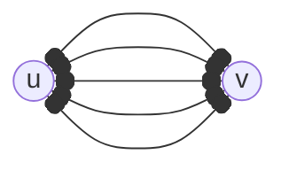
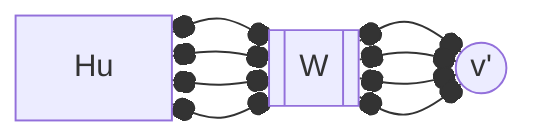
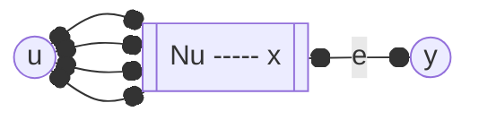

---
tags:
  - MATH_154
---
# Definition (Minimum to Disconnect)
If $u,v \in G$, that are not neighbors, then define $\kappa(u, v)$ as the minimum number of vertices to [[Connectivity#Definition (Reachability)|disconnect]] $u$ from $v$. 

Example:
```tikz
\usepackage{tikz-cd}
\begin{document}
\begin{tikzcd}
% https://q.uiver.app/#q=WzAsOCxbMCwyLCJ1Il0sWzMsMiwidiJdLFsxLDEsIlxcYnVsbGV0Il0sWzIsMCwiXFxidWxsZXQiXSxbMiwxLCJhIl0sWzEsMiwiXFxidWxsZXQiXSxbMSwzLCJcXGJ1bGxldCJdLFsyLDIsImIiXSxbMCwyLCIiLDAseyJzdHlsZSI6eyJoZWFkIjp7Im5hbWUiOiJub25lIn19fV0sWzIsMywiIiwwLHsic3R5bGUiOnsiaGVhZCI6eyJuYW1lIjoibm9uZSJ9fX1dLFszLDQsIiIsMCx7InN0eWxlIjp7ImhlYWQiOnsibmFtZSI6Im5vbmUifX19XSxbMiw0LCIiLDAseyJzdHlsZSI6eyJoZWFkIjp7Im5hbWUiOiJub25lIn19fV0sWzAsNSwiIiwyLHsic3R5bGUiOnsiaGVhZCI6eyJuYW1lIjoibm9uZSJ9fX1dLFswLDYsIiIsMix7InN0eWxlIjp7ImhlYWQiOnsibmFtZSI6Im5vbmUifX19XSxbNiw1LCIiLDEseyJzdHlsZSI6eyJoZWFkIjp7Im5hbWUiOiJub25lIn19fV0sWzUsNywiIiwxLHsic3R5bGUiOnsiaGVhZCI6eyJuYW1lIjoibm9uZSJ9fX1dLFs3LDEsIiIsMSx7InN0eWxlIjp7ImhlYWQiOnsibmFtZSI6Im5vbmUifX19XSxbNCwxLCIiLDEseyJzdHlsZSI6eyJoZWFkIjp7Im5hbWUiOiJub25lIn19fV0sWzQsN10sWzIsNSwiIiwxLHsic3R5bGUiOnsiaGVhZCI6eyJuYW1lIjoibm9uZSJ9fX1dXQ==
	&& \bullet \\
	& \bullet & a \\
	u & \bullet & b & v \\
	& \bullet
	\arrow[no head, from=1-3, to=2-3]
	\arrow[no head, from=2-2, to=1-3]
	\arrow[no head, from=2-2, to=2-3]
	\arrow[no head, from=2-2, to=3-2]
	\arrow[no head, from=2-3, to=3-3]
	\arrow[no head, from=2-3, to=3-4]
	\arrow[no head, from=3-1, to=2-2]
	\arrow[no head, from=3-1, to=3-2]
	\arrow[no head, from=3-1, to=4-2]
	\arrow[no head, from=3-2, to=3-3]
	\arrow[no head, from=3-3, to=3-4]
	\arrow[no head, from=4-2, to=3-2]
\end{tikzcd}
\end{document}
```
Here, we see that $\kappa(u,v) =2$, by removing vertices $a,b$. We can describe the set of [[Cut]] vertices as the **cutset** of $u,v$. 

# Lemma (Minimum Cut: Unique Paths)
If $\kappa > 1$ then $u,v$ are in the same block since we have no [[Cut|cut vertex]] to separate them. But then this means they share the same cycle by [[Block Graph#Theorem (Edges & Vertices Share a Cycle in a Single Block)|theorem]].  

If we $\ell$ vertex-disjoint $u \to v$ paths, then $\kappa \geq \ell$ as a lower bound. 

where cutting any path here still gives us another $\ell - 1$ paths to cut.

> We require vertex-disjoint because if two paths overlap, then removing the overlapping vertex disconnects both paths.

# Menger's Theorem (Vertex Form)
If $u,v \in G$, two non-adjacent vertices in a finite [[Graph]], then it is possible to find $\kappa(u, v)$ many vertex-disjoint [[Path|paths]].

Proof:
We proceed with strong induction on $|E|$. 

Base Case: If $|E| = 0$, then we can find $0$ paths, and thus $\kappa = 0$. The theorem holds.

Inductive Step: Let $|E| = m$. Assume Menger's Theorem holds for all graphs with $< m$ edges. Let $W$ be the minimum $u \to v$ vertex cutset of size $\kappa = \kappa(u, v)$,

where $W$ is our cutset. We see that in graph $G - W$, it forms at least two [[Connectivity#Theorem (Connected Components)|connected components]]. Denote $H_{v}$ as the subgraph with the vertex $v$ and likewise with $H_{u}$. 

We can form two new graphs by [[Minimum Spanning Tree#Graph Contraction|graph contraction]]:
$$
\begin{aligned}
G_{u} &:= V(H_{u}) \to u' \\ 
G_{v} &:= V(H_{v}) \to v' \\
\end{aligned}
$$
giving us graph $G_{u}$ 

and graph $G_{v}$

In graph $G_{u}$, cutset $W$ is a $u' \to v$ cut of size $\kappa$. By definition of $W$, this must be the minimum, such that $\kappa_{G_{u}}(u', v) = \kappa$. Symmetrically, $\kappa_{G_{v}}(u, v') = \kappa$. 

Since we did strong induction, we can apply the inductive hypothesis on $G_{u}$ and $G_{v}$. We have two cases: 

Suppose $H_{u}$ or $H_{v}$ contain at least one internal edge (i.e. an edge $(a, b$ where vertices $a,b \in E(H_{u})$). WLOG, upon graph contraction, we reduce the number of edges by at least one, such that $|E(G_{u})| < m$. 

Then we can apply the inductive hypothesis such that on $G_{u}$, there are $\kappa$ vertex-disjoint $u' \to v$ paths, corresponding to the $W \to v$ paths in $G$ from $H_{u}$. Likewise, on $G_{v}$ there are $\kappa$ vertex-disjoint $u \to v'$ paths, corresponding to the $u \to W$ paths in $G$ from $H_{v}$.

As $H_{u} \cap H_{v} = \varnothing$, then these two paths only intersect at $W$. Thus, we get $\kappa$ total vertex-disjoint paths from $u \to v$ in $G$. 

However, we need *strictly less* than $m$ edges to apply the IH. This works *unless* $H_{u} = \{u\}$ or $H_{v} = \{v\}$. The inductive steps fails here, since any minimum cut $W$ results in one of the contracted graphs having $m$ edges (since we do not remove any internal edges from $G_{u}$ or $G_{v}$).

WLOG, let $H_{u} = \{u\}$. Then the set of $u$'s neighbors[^1], $N(u) \subseteq W$. We have two cases depending on the intersection of $N(v)$. 

**Case 1**: Suppose $x \in N(u) \cap N(v)$. Then any cutset $W$ over $u \to v$ must contain $x$. Consider a new graph $G' = G - \{x\}$, which has *fewer edges* than $G$. Since $x$ is in every $W$, then min-cut $W'$ of $G'$ has size $\kappa' = \kappa - 1$. By the inductive hypothesis, there are $\kappa - 1$ vertex-disjoint $u \to v$ paths in $G'$ and thus $G$. But then we also have another path $u \to x \to v$ which exists in $G$ and is vertex-disjoint. 

This gives us a total of $\kappa - 1 + 1 = \kappa$ vertex-disjoint $u \to v$ paths, and we are done. 

**Case 2**: Suppose $N(u) \cap N(v) = \varnothing$. Then every vertex $w \in W$ is adjacent to either only to $u$ only to $v$, but not both. Since $|E(G)| > 0$, then there must be some edge $e = (x, y)$ where $x \in N(u)$ and $y \not\in N(v) \cup \{u\}$. 

Let graph $G' = G - \{e\}$. Then we can apply the inductive hypothesis on $G'$ such that $\kappa_{G'}(u, v) = \kappa'$. But removing an arbitrary edge *may or may not* reduce $\kappa$, such that 
$$
\kappa_{G'}(u, v) = \kappa' \leq \kappa = \kappa_{G}(u, v)
$$
This gives us two cases:

**Case 2A**: If $\kappa' = \kappa$, then by the inductive hypothesis, we get that $G'$ has a $\kappa$ many vertex-disjoint $u \to v$ paths, which are also paths in $G$.

**Case 2B**: It is possible that the set that we cut is all of the neighbors of $u$, such that $\kappa' < \kappa$. Since we remove one edge, then we can only remove $u \to v$ path, such that $\kappa_{G'}(u, v) = \kappa - 1$. By the induction hypothesis, we have $\kappa - 1$ vertex-disjoint $u \to v$ paths in $G'$. 

Let $W'$ be the minimum cutset in $G'$ for $u,v$. We know $|W'| = \kappa - 1$. But then $W'$ is not a $u \to v$ cutset in $G$ since the minimum is of size $\kappa$. Indeed, this means there are some vertices we "miss" from cutting $W'$ in $G$. Since the only difference is $e$, then we can construct some minimal path $P$ in $G$ that must use $e$. This gives 
$$
P : u \to x \to y \to v
$$
Consider set $X = W' \cup \{x\}$. Any $u \to v$ path in $G$ must have some vertex in $W$. If not, then it must have the form $u \to x \to y \to v$. Therefore $X$ is a minimum cut for $G$. By the same logic, we can say that $Y = W' \cup \{y\}$ is a minimum cut in $G$. 

Since both $X,Y$ are minimal cuts, then we apply **Case 2**, such that $x$ is adjacent to $u$ and cannot be adjacent to $v$ (otherwise their neighborhoods are not disjoint). 

But this must also be true for $y$. Vertex $y$ must be "adjacent only to $u$" or "adjacent only to $v$". 
1. If the former, then edge $(u, y)$ exists, such that our path $P$ is not minimal (since we can by skip $x$ entirely), a contradiction.
2. If the latter, then $(x, y)$ cannot exist, since it would mean $y$ is adjacent to some vertex other than $v$, contradicting our **Case 2** premise. 

This meas **Case 2B** cannot happen, so $\kappa' = \kappa$. By the inductive hypothesis on $G'$, there are $\kappa$ vertex-disjoint $u \to v$ paths in $G'$ which are also paths in $G$. 

This completes the proof. 

> See [link](https://www.math.nagoya-u.ac.jp/~richard/teaching/s2024/SML_Ch_3.pdf), which closest resembles the proof in class. 

[^1]:Fix $u \in V(G)$. For every edge $(a, u)$, $N(u)$ is the set of such $a$.

# Menger's Theorem (Weak Edge Form)
Let $\lambda(u, v)$ represent the minimum number of removed edges to separate $u$ from $v$. Then 
$$
\lambda(u, v) \geq \text{max number of edge-disjoint paths from } u \to v
$$
Equality is true. But this is proved in the [[Maxflow-Mincut Theorem]] which will be proved later in the course. 