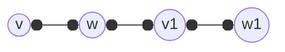
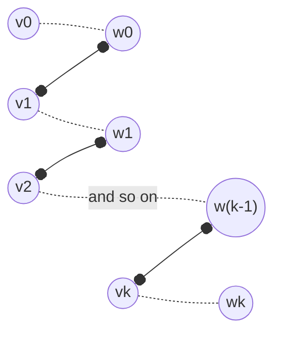
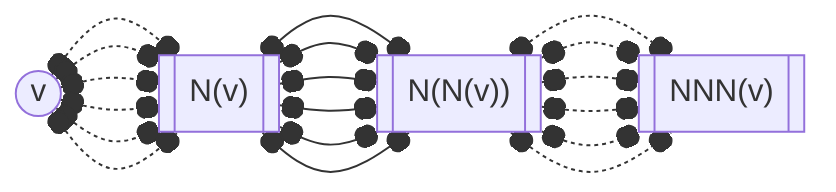

---
tags:
  - MATH_154
---
This is also known as the Marriage Theorem.
# Hall's Theorem 
Given a [[Bipartite Graph]] $G = (L, R)$, there is a matching that matches all $L$ *unless* there exists $S \subset L$ such that $|S| > |N(S)|$. 

We extend the definition of a [[Graph#Definition Vertex Neighborhood|neighborhood]] of vertices to some set $S$, such that 
$$
N(S) = \{v \in R \mid v \in N(s), s \in S\}
$$
Proof: 

Start with a *maximum* matching. If it matches everything on $L$, we are done. Otherwise, there is some unmatched vertex $v \in L$. If $N(v) = \varnothing$, then we are done. Suppose not, then every $w \in N(v)$ must have been matched already. Let $(w, v_{1})$ be that matching. 

Consider $N(v_{1})$. If there is some $w_{1} \in N(v_{1})$ that has not been matched, we can match $(v_{1}, w_{1})$, freeing $(w, v_{1})$, allowing us to match $(v, w)$. On the other hand, $w_{1}$ may have already been matched. We can repeat this for some $v_{2} \in N(w_{1})$.  

This creates an *augmenting path*, where 
$$
v = v_{0}, w_{0}, v_{1},w_{1},v_{2},w_{2}, \dots, v_{k}, w_{k}
$$
where the edges are $(v_{i}, w_{i})$ and $(w_{i}, v_{i+1})$ are in the matching, and vertices $v_{0}, w_{k}$ are unmatched. The picture here is that 

**Lemma:** If the matching has an augmenting path, then it is not maximum.

The proof of this is that we can replace these edges $(w_{i}, v_{i+1})$ by a bunch of edges $(v_{w}, w_{i})$ which are represented by the dotted lines. In particular, we will now have $k + 1$ edges, which is a larger matching set and is a contradiction.

Back to the proof, we know that $v$ must have no augmenting path. Otherwise, we have a contradiction from the lemma. 

So, consider 

and so on. Every one of these vertices must be matched to ensure no augmenting path is possible. Consider every $w \in R$ that are candidates for some augmenting path (all vertices in  odd $i$ for $N^{i}(v)$. All such $w$ are matched. Indeed, let $T$ be the set of such vertices. Let 
$$
S = \{v\} \cup \{\text{vertices matched to } T\}
$$
Firstly, $|S| = |T| + 1$ because the vertices in $S$ are vertices matched to $T$, and $v$. Secondly, $N(S) = T$. In particular, we will have found $|S| > |N(S)|$, which means there is no matching, a contradiction.

# Proposition (Regular Bipartite Has Perfect Matching)
Every non-empty [[Degree#Definition $d-$regular|regular]] [[Bipartite Graph|bipartite]] graph has a **perfect matching**. That is, there is a matching that matches all vertices. 

Proof:

Let the graph be $d-$regular. We apply the [[Bipartite Handshake Lemma]]. 
$$
\begin{aligned}
\sum_{v\in L} \deg(v) &= \sum_{v \in R} \deg(v) \\ 
d|L| &= d|R| \\ 
|L| &= |R| \\
\end{aligned}
$$
Now, it is sufficient to show that for any subset $S \subseteq L$, $|S| \leq |N(S)|$ holds, and that by [[Hall's Theorem]], there is a matching. Let $S$ be some subset, and let $H$ be the [[Graph#Definition (Induced Subgraph)]|induced subgraph]] on $S \cup N(S)$. In $H$, every vertex in $S$ has [[Degree|degree]] $d$. For $w \in N(S)$, then $\deg_{H}(w) \leq d$.  By the Bipartite Handshake Lemma, 
$$
\begin{aligned}
\sum_{v \in S} \deg_{H}(v) &= \sum_{v \in N(S)} \deg_{H}(v) \\
d|S| &\leq d|N(S)| \\ 
|S| &\leq N(S) \\
\end{aligned}
$$
which indicates there is a matching. And as $|L| = |R|$, there must be a perfect matching. 

# Lemma (Matching Max Degree Left Vertices)
There exists a matching $M$ that matches all of the maximum degree left-vertices. 

Proof:

Let $M \subseteq L$ where $v \in M$ has $\deg_{G}(s) = \Delta(G)$. We can consider $G' = M \cup N(M)$. By [[#Hall's Theorem]], there is a matching for the LHS vertices, unless $\exists S$ where $|S| > |N(S)|$. 

Consider $G''$ of just $S \cup N(S)$. By [[Bipartite Handshake Lemma]], 
$$
\begin{aligned}
k|S| = \sum_{v \in S} \deg_{G''}(v) &=
\sum_{v\in N(S)} \deg_{G''}(v) \leq k|N(S)| \\ 
|S| \leq |N(S)|
\end{aligned}
$$
but this is a contradiction.
