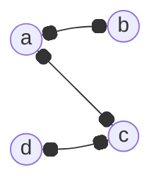

---
tags:
  - MATH_154
---
# Definition (Matching)
In a [[Graph]] $G$, a **matching** is a set of edges where no vertex is incident to more that a single edge in that set of edges. 

Generally, we will talk about [[Bipartite Graph#Definition (Bipartite Graph)|biparite]] matchings, but you can extend thus definition further. 
# Definition (Maximal Matching)
A matching is **maximal** if you cannot add an extra edge. This matching is **maximum** if no other matching has more edges. 

Consider:

Here, edge set $\{(a, c)\}$ is maximal because adding any other edge would violate matching. But, edge set $\{(a, b), (c, d)\}$ is maximal, because no other larger matching exists.
