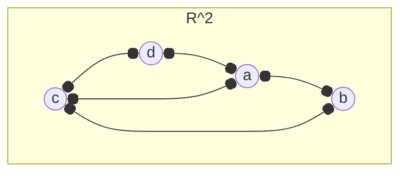

---
tags:
  - MATH_154
aliases:
  - planar
---
# Definition (Planar Embedding)
A **Planar Embedding** of a [[Graph]] $G$ is a drawing in the plane without crossing any edges. For example, 

has a planar embedding. A graph $G$ is **planar** if it has a planar embedding. 

# Definition (Planar Faces)
Given a planar embedding of some graph $G$, this was split the plane into **faces**, the connected regions of the $\R^{2} \setminus G$. 

For example, in the graph above, we have region $acd, abc$, and the ambient space. 

# Example Planar Graphs
We have the following table:

| Graph                                     | Faces       | Vertices    | Edges     | Faces - Edges + Vertices |
| ----------------------------------------- | ----------- | ----------- | --------- | ------------------------ |
| [[Tree]]                                  | $1$         | $n$         | $n-1$     | $2$                      |
| [[Cycle]]                                 | $2$         | $n$         | $n$       | $2$                      |
| [[Cycle#Definition (Wheel Graph)\|Wheel]] | $n+1$       | $n+1$       | $2n$      | $2$                      |
| Grid with $n \times n$ squares            | $n^{2} + 1$ | $(n+1)^{2}$ | $2n(n+1)$ | $2$                      |
## Euler's Formula
If $G$ is a finite, [[Connectivity|connected]] [[Planar Graph#Definition (Planar Embedding)|planar]] [[Graph|graph]], then any planar embedding has 
$$
|F| - |E| + |V| = 2
$$
where $F$ is the set of faces formed by $G$. 

Proof: We prove by induction on $|E|$. 

Base Case: $|E| = |V| - 1$. By [[Tree#Lemma (Tree Edge Count)]], this is a tree. We are done 

Assume that any graph with fewer edges and the same number of vertices satisfies Euler's Formula. If $|E| < |V|$, then $G$ is not connected, a contradiction. If $|E| \geq |V|$ then $G$ is not a tree and has a cycle $C$ and some edge $e \in C$. 

Consider 
$$
G' = G - \{e\}
$$
Then 
- $|V(G)| = |V(G')|$ 
- $|E(G)| = |E(G')| + 1$
- $|F(G)| = |F(G')| + 1$
because when remove $e$, we "open up" the cycle and merge two faces together. By the induction hypothesis, 
$$
\begin{aligned}
|V(G)| - |E(G)| + |F(G)| 
&= |V(G')| - ( |E(G')| + 1 ) + (|F(G')| + 1) \\
&= |V(G')| - |E(G')| + |F(G')| \\
&= 2
\end{aligned}
$$
and we are done. 
# Theorem (Planar Graph Edge Bound)
If $G$ is a connected [[Planar Graph]] with $|V| \geq 3$, then 
$$
|E| \leq 3|V| - 6
$$
Proof:  By [[Planar Graph#Euler's Formula|Euler's Formula]], and [[Polyhedra#Lemma (Faces Have At Least 3 Sides)|lemma]] , we have 
$$
2 = |V| - |E| + |F| \leq |V| - |E| + \frac{2|E|}{3} = |V| - \frac{|E|}{3}
$$
Rearranging, we get $|E| \leq 3|V| - 6$.

> Equality is achieved iff all faces are triangles.
## Theorem ($K_{5}$ is Non-Planar)
The [[Complete Graph]] $K_{5}$ is non-planar. 

Proof: If it was, then by [[#Theorem (Planar Graph Edge Bound)]],
$$
10 = |E| \leq 3|V| - 6 = 9
$$
a contradiction. 

## Theorem ($K_{3,3}$ is Non-Planar)
The [[Bipartite Graph#Definition (Complete Bipartite Graph)|complete bipartite graph]] $K_{3,3}$ is non-planar. 

Proof: Since it is bipartite, it has no odd cycles by [[Connectivity#Theorem (Bipartite Cycles)]]. Therefore if it was planar, then any face has at least $4$ sides. Thus, by [[#Theorem (Planar Graph Edge Bound)]],
$$
9 = |E| \leq 2|V| - 4 = 8
$$
a contradiction. 
# Theorem (Planar Graphs have Bounded Minimum)
If $G$ is a finite, [[Connectivity|connected]] planar graph, then $G$ has minimum [[Degree]] $\delta(G) \leq 5$. 

Proof: Otherwise, $\delta(G) \geq 6$. Then by [[Handshake Lemma]], 
$$
2|E| = \sum_{v \in V} \deg(v) \geq 6|V|
$$
such that $|E| \geq 3|V|$. But then 
$$
3|V| -6 \geq |E| \geq 3|V|
$$
by [[#Theorem (Planar Graph Edge Bound)]] which is a contradiction. 