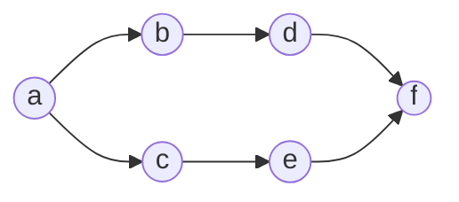
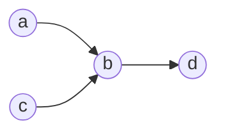

---
tags:
  - MATH_154
---
# Definition (Network)
A **network** is a [[Directed Graph]] with $2$ specified vertices, the **source** and the **sink**.  It can potentially be [[Weighted Graph#Definition|weighted]]. 

Here, $a$ is the source, and $f$ is the sink. 

# Definition (Flow)
In a network, a **flow** is a collection edged $F$ such that for every vertex $v$ except the source and the sink, 
$$
|\{\text{edges of $F$ going out of $v$}\}| = |\{\text{edges of $F$ going into $v$}\}|
$$
In the above graph, it has a flow. One example of a not-flow is a 

where $b$ has $2$ in and $1$ out, so there is no flow.
## Definition (Flow Size)
The **size** of a flow is the number of edges of $F$ leaving the source minus the number of edges of $F$ going into the source. 

# Definition (Network Cut)
A **cut** in a network (or a **network cut**) is a partition of the vertices into two sets one of which contains the source and one of which contains the sink. 

> Related: [[Cut]]. 

## Lemma (Size of Flow Given any Cut)
Suppose we have a network $N$, a flow $F$, with cut $(S, T)$ to denote the source and sink respectively. Then 
$$
\text{size}(F) = | \{ \text{edges in $F$ that go from $S \to T$} \} | 
- | \{ \text{edges of $F$ that go from $T \to S$} \} |
$$
This means we can use any network cut to compute the flow.

Proof: 

Consider 
$$
\sum_{v \in V} |\{\text{edges of $F$ out of $v$}\}| - |\{\text{edges of $F$ into $v$}\}|
$$
then the summand is $0$ by definition, unless $v$ is equal to the source. So really, this is just the number of edges of $F$ out of $S$ minus the number of edges into $S$. By definition, this is the size of the flow. 

We can also compute this over the sum of edges. So, 
$$
\begin{aligned}
&= \sum_{e \in E} [+1 \text{ if $e$ from a vertex in $S$}] + [-1 \text{ if $e$ into a vertex in $S$}] \\
&= \sum_{e} (\text{0 if e: $S \to S$}) + (\text{0 if $e: T \to T$}) 
+ (+1 \text{ if $e : S \to T$}) 
+ (-1 \text{ if $e : T \to S$}) \\
&= |\{\text{edges from $S \to T$} \}| - |\{\text{edges from $T \to S$}\}|
\end{aligned}
$$
which is the same. 

# Definition (Augmenting Path)
Given a flow $F$ in a network $N$, and **augmenting path** is a [[Path]] from $S \to T$ (source to sink) where each edge $e$ is either 
- in $N$ but not $F$. 
- whose reverse is in $F$ 

Given a flow F and augmenting path $A$, we can add a $A$ to $F$. In particular, if we have edge $e \in A$, we can add to $N \setminus F$, then we add the edge to the flow. If $e \in A$ whose reverse is in $F$, we can add to $F$. 

## Lemma (Add Augmenting Path to Flow)
We can make a new flow $A + F$ with 
$$
\text{size}(A + F) = \text{size}(F) + 1
$$
Proof: 

If $e = (u, v) \in A$, and we either add $e$ to $F$ or remove $e^{R}$ from $F$, then this changes the net flow *out* of $u$ by $1$, and the network flow *out* of $v$ by minus 1. But if 
$$
A := (v_{0}, v_{1})(v_{1,}v_{2}) \dots (v_{n-1},v_{n})
$$
where $v_{0}$ is the source and $v_{n}$ is the sink, every intermediate vertex must cancel. For example, $v_{1}$ give $1$ in and $1$ out. This gives us a large telescope where every not sink/source vertex cancels. 

But $v_{0}$ gives us one more net flow, and $v_{n}$ reduces one net flow. Here, we get one extra unit of flow from $v_{0}$, giving us the proof. 

# Lemma (Maxflow is at Most the Mincut)
The maximum [[#Definition (Flow)|flow]] of a [[#Definition (Network)|network]] is $\leq$ the size of the minimum [[#Definition (Network Cut)|cut]]. 

Proof: 

We showed that from [[#Lemma (Size of Flow Given any Cut)|lemma]], we can pick any cut. So, the mincut is equal to $\text{size}(c)$ for some cut $c$, which will partition $(S, T)$. From the same lemma, we showed that 
$$
\text{size}(F) = |\{\text{edges from $S \to T$ } \}| - |\{\text{edges from $T \to S$}\}|
$$
Clearly, this is at most $\text{size}(c)$. 