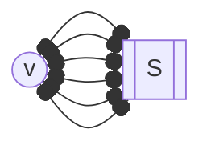

---
tags:
  - MATH_154
---
# Theorem (Bichromatic K6 has Monochromatic K3)
Given any coloring of the edges of a [[Complete Graph]] $K_{6}$ with two [[Coloring#Definition (Coloring)|colors]], there is always a monochromatic $K_{3}$ subgraph. 

Proof: 

Select any vertex $v \in K_{6}$, and suppose our two colors were red and blue. Since $\deg(v) = 5$ and there are two colors, by the Pidgeonhole Principle, either $v$ has $3$ red edges or blue edges. Suppose it has $3$, such that $a,b,c$ are the incident vertices of those red edges. 

If there is a red edge between any two of $a,b,c$ then we have $K_{3}$. If not, then $a,b,c$ must have blue edges between them, which forms $K_{3}$. 

Therefore we have a monochromatic $K_{3}$ in either case. 

```tikz
\usepackage{tikz-cd}
\begin{document}
\begin{tikzpicture}[
    vertex/.style={circle, draw, fill=white, inner sep=2pt, font=\small},
    red_edge/.style={red, thick},
    blue_edge/.style={blue, thick},
    highlight_red_edge/.style={red, ultra thick},
    node distance=2cm,
    every node/.style={font=\small}
]

    % Place nodes in a circle
    \foreach \i in {1,...,6} {
        \node[vertex] (\i) at ({360/6 * (\i - 1)}:3cm) {\i};
    }

    % Draw edges and color them
    % Group 1: Highlighted Red K3 (1-2-5)
    \draw[highlight_red_edge] (1) -- (2);
    \draw[highlight_red_edge] (2) -- (5);
    \draw[highlight_red_edge] (5) -- (1);

    % Group 2: Other Red Edges
    \draw[red_edge] (1) -- (3);
    \draw[red_edge] (2) -- (4);
    \draw[red_edge] (3) -- (6);
    \draw[red_edge] (5) -- (6);

    % Group 3: Blue Edges (the rest)
    \draw[blue_edge] (1) -- (4);
    \draw[blue_edge] (1) -- (6);
    \draw[blue_edge] (2) -- (3);
    \draw[blue_edge] (2) -- (6);
    \draw[blue_edge] (3) -- (4);
    \draw[blue_edge] (3) -- (5);
    \draw[blue_edge] (4) -- (5);
    \draw[blue_edge] (4) -- (6);

\end{tikzpicture}
\end{document}
```
# Ramsey's Theorem
For any positive integers $p,q$, there $\exists N$ so that for any $n \geq N$ and any red-blue coloring of the edges of a [[Complete Graph|complete graph]] $K_{n}$, there is either a red $K_{p}$ or a blue $K_{q}$. 

In particular, we defined the smallest such number $N$ as the **Ramsey Number**, $R(p, q)$. 

Proof: 

We proceed by induction on $p + q$. If $p = 1$ or $q = 1$, then any coloring of a $K_{1}$ is red or blue. Indeed 
$$
R(1, q) = R(p, 1)
$$
Assume $R(p', q')$ is finite for all $p' + q' < p + q$. For $p, q > 1$ we will show not only that $R(p, q)$ is finite, but that 
$$
(*) \quad\quad\quad\quad R(p, q) \leq R(p - 1, q) + R(p, q - 1)
$$
Take that
$$
n \geq R(p - 1, q) + R(p, q - 1)
$$
and color $K_{n}$. Consider vertex $v \in K_{n}$. Then 
$$
\deg_{K_{n}}(v) = n - 1 \geq R(p - 1, q) + R(p, q - 1) - 1
$$
Indeed, $v$ has *at least* that many edges. By the Pidgeonhole Principle (recall this is the same technique we used in proving the previous [[#Theorem (Bichromatic K6 has Monochromatic K3)|theorem]]), either it has
- $R(p - 1, q)$ red edges 
- or $R(p, q -1)$ blue edges. 
WLOG, let $v$ have that many red many edges to the other vertices $S$. 

To be more precise,  + \omega(K_{p}
$$
S = \{ u \in N(v)\;|\; (u,v) \in E \text{ is colored red}\}
$$
Thus, $|S| \geq R(p - 1, q)$. This lets us apply the inductive hypothesis, such that either $S$ contains
- red $K_{p-1}$ 
	- In this case, we form $K_{p} = K_{p-1} \cup \{v\}$. Where $K_{p-1}$, the red [[Clique]] of $p$.
- blue $K_{q}$ 
	- We get blue $K_{q}$
Either way, we get our desired result. 
## Computing Ramsey Numbers
- $R(p, q) = R(q, p)$ by symmetry 
- $R(1, n) = 1$
- $R(2, n) = n$
	- any red edge gives red $K_{2}$
	- or we can color$K_{n}$ entirely blue
	- Consider $K_{n-1}$. We can have red $K_{2}$, but we cannot have blue $K_{n}$, so this is not a lower bound. 
- $R(3, 3) = 6$. 
	- We can show that $R(3, 3) \leq R(2, 3) + R(3, 2) =  3 + 3 = 6$. This is due to $(*)$ in the proof of [[#Ramsey's Theorem]]. 
	- To show it cannot be smaller, then we would need to show an invalid coloring on $K_{5}$. Indeed, the following is a coloring of $K_{5}$ where there is no $K_{3}$ red or blue. 
```tikz
\usepackage{tikz-cd}
\begin{document}
\begin{tikzpicture}[
    vertex/.style={circle, draw, fill=black, inner sep=2pt},
    red_edge/.style={red, thick},
    blue_edge/.style={blue!80!cyan, thick},
    node distance=2cm
]

    % Place 5 nodes in a circle, starting at 90 degrees (top)
    \foreach \i in {1,...,5} {
        \node[vertex] (\i) at ({90 + 360/5 * (\i - 1)}:2cm) {};
    }

    % Group 1: Red Edges (The Pentagon)
    \draw[red_edge] (1) -- (2);
    \draw[red_edge] (2) -- (3);
    \draw[red_edge] (3) -- (4);
    \draw[red_edge] (4) -- (5);
    \draw[red_edge] (5) -- (1);

    % Group 2: Blue Edges (The Star)
    \draw[blue_edge] (1) -- (3);
    \draw[blue_edge] (3) -- (5);
    \draw[blue_edge] (5) -- (2);
    \draw[blue_edge] (2) -- (4);
    \draw[blue_edge] (4) -- (1);

\end{tikzpicture}
\end{document}
```
- $R(3, 4) = 9$
	- The upper bound is found by showing any red-blue coloring of a $K_{9}$ has either a red $K_{3}$ or blue $K_{4}$. We know that $R(3, 3) + R(2, 4) = 6 + 4 = 10$. So, consider $K_{9}$. 
	- Pick some $v \in K_{9}$. If $v$ has at least $4$ red $v \to S$ edges, then as $S$ is at least a $K_{4}$, if any internal edge is red, we have red $K_{3}$ (include $v$). If not, then all edges must be blue. But then we at least have a blue $K_{4}$, as desired. 
	- If $v$ has at least $6$ blue $v \to S$ edges, then we apply the same logic. More importantly, since $R(3,3) = 6$, then we are guaranteed to have red $K_{3}$ or blue $K_{3}$. 
		- If red $K_{3}$ we are done.
		- If blue $K_{3}$, add $v$, giving us blue $K_{4}$ we are done. 
		- Note that we can do the same for the previous case with $R(2, 4)$. 
	- Otherwise, each vertex must have $5$ blue and $3$ red edges.
	- However, this violates the [[Handshake Lemma]]. The total number of red edges is $(9 \cdot 3)/2 = 13.5$, so any coloring of the graph means there must be at least one vertex of $6$ blue and $4$ edges. 
- $R(4, 4) = 18$ 
	- We see that $R(4, 4) \leq R(3, 4) + R(4, 3) = 9 + 9 = 18$. So it suffices to show that $R(4,4) > 17$. 
		- The lower bound requires to do some construction. In particular, we arrange $17$ vertices in a circle and d raw a red edge between two if they are separated by $1,2,4,8$ steps. 
		- Leave the other edges blue, and symmetry makes this easy.
- The other known Ramsey Numbers. See [here](https://en.wikipedia.org/wiki/Ramsey%27s_theorem#Known_values). 

# Theorem (Upper Bound On Ramsey Numbers)
$$
R(p, q) \leq 2^{p + q}
$$
Proof: Induct on $p + q$. If $p = 1$ or $q = 1$, then $R(p, q) = 1 < 2^{p + q}$. Now assume the inequality holds for smaller $p + q$. Then 
$$
\begin{aligned}
R(p, q) & \leq R(p - 1, q) + R(p, q - 1) \\ 
& \leq 2^{p + q - 1} + 2^{p + q - 1} \\
& \leq 2^{p + q}
\end{aligned}
$$
and we are done. 
# Theorem (Lower Bound on Ramsey Numbers) 
If $n \geq 3$, then $R(n, n) \geq 2^{n/2}$. 

Proof: 

We note that $R(p, q) \geq 2^{\min(p, q)/2}$. Combined with the upper bound, this says the symmetric Ramsey Numbers are exponentially large. 

The key idea is to *randomly* color $K_{N}$. On average, how many chromatic $K_{n}$'s are there in $K_{N}$? There are approximately $N^{n}$ many collections of $n$ vertices. Each has 
$$
\approx 2^{-n(n-1)/2}
$$
probability of being monochromatic. So, the average is 
$$
\frac{N^{n}}{2^{n(n-1)/2}} \approx \left[ \frac{N}{2^{(n-1)/2}} \right]^{n}
$$
If $N$ is much smaller than $2^{n/2}$, then this is less than $1$, so *some* coloring must have none.

# Definition (Graph Ramsey Number)
For graphs $G,H$, we define the **graph Ramsey Number** $R(G, H)$ to be the minimum $n$ so that any red-blue coloring of $K_{n}$ has either a red copy of $G$ or a blue copy of $H$. 

Note that since $G,H$ are contained in complete graphs, then $R(G, H)$ is finite.

For example, $R(C_{4}, C_{4})  = 6$. To prove the lower bound, we need to show any coloring of $K_{5}$ contains no monochromatic $C_{4}$. For the upper bound, one must show any $2-$[[Edge Coloring|edge coloring]] of $K_{6}$ has at least one monochromatic $C_{4}$. 

## Theorem (Graph Ramsey Number Upper Bound)
$$
R(G, H) \leq R(|V_{G}|, |V_{H}|)
$$
Note that the RHS is shorthand for the [[#Ramsey's Theorem|Ramsey Number]] notation. It is equivalent to $R(K_{|V_{G}|}, K_{|V_{H}|})$.

Proof: 

Let $m = R(|V_{G}|, |V_{H}|)$. Any red-blue coloring of $K_{m}$ has either a monochromatic complete red graph on $|V_{G}|$ or monochromatic blue complete graph on $|V_{H}|$. These contain a red copy of $G$ or blue copy of $H$, by embedding $G$ in $K_{|V_{G}|}$ and likewise for $H$ and $K_{|V_{H}|}$. 

# Theorem (Graph Ramsey Number: Tree, Complete)
If $m,n$ are integers with $m-1$ dividing $n-1$ and $T_{m}$ is a [[Tree]] with $m$ vertices then 
$$
R(T_{m}, K_{1,n}) = m + n - 1
$$
Proof: 

We first want to find a lower bound. In particular, we want to color $K_{m + n - 2}$ without a red $T_{m}$ or blue $K_{1,n}$. Note the that 
$$
m + n - 2 = (m - 1) + (n - 1) \implies m - 1 \mid m + n - 2
$$
We color $K_{m + n - 2}$ by partitioning it into red $K_{m-1}$ and connect them with blue edges. 
```tikz
\usepackage{tikz-cd}
\begin{document}
\begin{tikzpicture}
    % Node style: Red circle with black border, black text
    \tikzset{vertex/.style={circle, draw=black, very thick, fill=red, text=black}}
    % Edge style: Blue, thick line
    \tikzset{edge/.style={blue, line width=3.5pt}}

    % Vertex Coordinates
    \node[vertex] (TC) at (0, 1.5) {$K_{m-1}$};    % Top Center
    \node[vertex] (TL) at (-3.5, 0.8) {$K_{m-1}$}; % Top Left
    \node[vertex] (TR) at (3.5, 0.8) {$K_{m-1}$};  % Top Right
    \node[vertex] (BL) at (-1.5, -1.8) {$K_{m-1}$};% Bottom Left
    \node[vertex] (BR) at (1.5, -1.8) {$K_{m-1}$}; % Bottom Right

    % Edges
    \draw[edge] (TL) -- (TC);
    \draw[edge] (TL) -- (BL);
    \draw[edge] (TC) -- (BL);
    \draw[edge] (TC) -- (BR);
    \draw[edge] (TC) -- (TR);
    \draw[edge] (BL) -- (BR);
    \draw[edge] (BR) -- (TR);

\end{tikzpicture}
\end{document}
```
Indeed, we have no red $T_{m}$, since 
- the only red edges are in $K_{m-1}$
- every vertex in a $K_{m-1}$ is in a [[Cycle]] and thus cannot be in a tree

Likewise, there are no blue [[Bipartite Graph#Definition (Complete Bipartite Graph)|complete bipartite graph]] $K_{1,n}$ (star graph with $n$ edges) since each vertex has at most a blue degree of 
$$
(m + n - 3) - (m - 2) = n - 1
$$
where there are $(m + n - 3)$ other vertices, and $(m - 2)$ other vertices in each red $K_{m-1}$, such that we can only make $n - 1$ other blue edges. Because $n - 1 < n$, we cannot make $K_{1,n}$. 

For the upper bound, we need to show that any red-blue coloring of a $K_{n + m - 1}$ has either a red $T_{m}$ or a blue $K_{1,n}$. If any vertex has $n$ or more blue edges, we have a blue $K_{1,n}$. Otherwise, consider subgraph $G_{r}$, the graph of only red edges. 

Let $v \in G_{r}$. Then as every vertex has less than $n$ blue edges, 
$$
\begin{aligned}
\deg_{G_{r}}(v) 
&= \deg_{K_{n + m - 1}}(v) - \deg_{\text{blue}}(v)  \\
&\geq (n + m - 2) - (n - 1) \\ 
&= m - 1
\end{aligned}
$$
Therefore $\delta(G_{r}) \geq m - 1$ by construction. 

**Lemma**: Let $T$ be any tree on $k$ vertices and $G$ a [[Graph|graph]] with $\delta(G) \geq k - 1$. Then $G$ contains a copy of $T$. 

The proof idea is to build on $T$ one vertex at a time form $G$. We proceed by induction on $k$. If $k = 1$, then it is trivial to embed a single point. Assume we can embed any tree on $k - 1$ vertices. Let $v$ be a [[Tree#Definition (Leaf)|leaf]] of $T$. Removing $v$ and its singular edge $(u, v)$ gives us $T'$. By the inductive hypothesis, we can embed $T'$ in $G$. We now need to add back $e$ by picking some $v' \in G$ to represent $v$ (if we can do this, then we have embedded $T$ in $G$). Since $\delta(G) \geq k - 1$ and $|V(T')| = k - 1$, then we have at minimum $(k - 1) - (k - 2) = 1$ vertices not paired with $u$, indeed this is $v'$, and by adding $(u, v')$, this is our tree $T$ with $k$ vertices, and we are done. 

Back to the proof, $\delta(G_{r}) \geq m - 1$ implies that we have a red tree $T_{m}$, completing the theorem. 