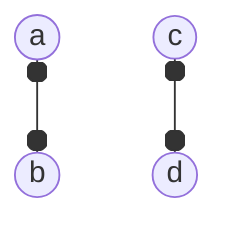
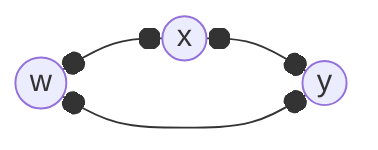
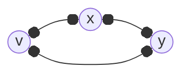
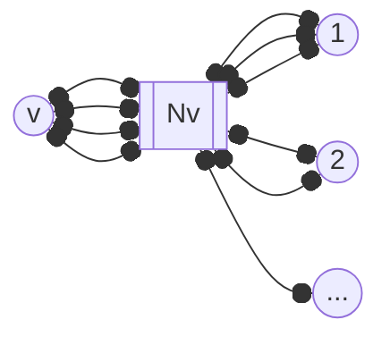

---
tags:
  - MATH_154
---
# Definition (Graph Copy)
We say a [[Graph]] $G$ has a **copy** of another graph $F$ if $G$ has a subgraph that is isomorphic to $F$. 
# Definition (Turan Numbers) 
Define 
$$
\text{ex}(n, F)
$$
as the *greatest* number of edges that a graph on $n$ vertices that does not have a copy of $F$ can have. 

## Examples
Consider $\text{ex}(n, K_{1,2})$. Then we cannot have any copies like 

which means we cannot have vertices of [[Degree]] more than $1$. Otherwise, we would get a copy of the [[Complete Graph]] $K_{1,2}$. This tell us our graph is a collection of disjoint $K_{2}$s and maybe $K_{1}$s. In particular, we only care about the edges, so at most we can have $\lfloor n/2 \rfloor$. 

More generally, for $K_{1,r}$, then $G$ must have [[Degree#Definition (Maximum Degree of a Graph)|maximum degree]] $\Delta(G) < r$. By the [[Handshake Lemma]], then the number of edges $|E| \leq \frac{n(r - 1)}{2}$. Furthermore, if this is not an integer, then 
$$
|E| = \min\left(\binom{n}{2}, \left\lfloor \frac{n(r - 1)}{2} \right\rfloor \right)
$$
Let $F$ be the following graph 

Then 
$$
\text{ex}(n, F) = \begin{cases}
n - 1 & n \geq 4  \\
\binom{n}{2} & \text{otherwise} \\
\end{cases}
$$

### Extremal Triangles 
Likewise $\text{ex}(n, K_{3}) = \lfloor n^{2}/4 \rfloor$. The way to look at it is to consider the maximal (in terms of edges) graph with no $K_{3}$. Consider $v$ where $\deg(v) = \Delta(G)$ and a non-adjacent vertex $w$. Potentially, $N(v) \cap N(w) \neq \varnothing$. We can replace $u \in N(w)$ with $u' \in N(v)$. 

We claim this creates no triangles and it can only increase the number of edges. If this edit creates a new triangle, then we have: 

Since $w \not \in N(v)$, then $x,y \neq v$. But then as $x,y \in N(w)$, then by construction, $x,y \in N(v)$. This implies that we have another triangle,  

which is a contradiction on the assumption $G$ does not have any triangles. Then $|E|$ gained $|N(v)|$ and lost $|N(w)|$ edges. But as $v$ was maximal, then 
$$
|N(v)| - |N(w)| \geq 0
$$
creating more edges. 

What if we continued this on every non-adjacent $w$? Then every non neighbor of $v$ connects to every neighbor of $v$. 

but this is a complete [[Bipartite Graph]]. But no matter graph we start with, we can always turn it to a bipartite graph. So if vertices $\{1, 2, \dots\}$ are $k$ and $|N(v)| = n - k$, then 
$$
|E| \leq | E(K_{k, n-k}) | = k(n - k) = 
\begin{cases}
\frac{n^{2}}{4} & n \text{ is even} \\
\frac{(n+1)(n-1)}{4} & n \text{ is odd}
\end{cases}
$$
but to maximize this, $k$ and $n - k$ must be as close as possible. If even, then $k = n/2$, and odd, then $k = n + 1$ (or $n - 1$). 

### Extremal Completes
What about $\text{ex}(n, K_{r})$? Let $r > 3$. If $r = 2$ we cannot have edges and it is $0$. The complete bipartite graph example is quite *good*. We have $n^{2}/4$ edges over at most $n^{2}/2$. One way to show we have no triangles is to show a left and right part. Indeed, for any three vertices, by Pidgeonhole, at least $2$ vertices must be in the same part, and thus those two cannot be connected. 

To generalize this, consider a $(r - 1)$-partite graph, where the vertices are grouped into $(r - 1)$ parts and there are edges between every pair of vertices in different parts but none in the same part. 

Given this graph, we do not have a $K_{r}$ in it. For any $r$ vertices, by the Pidgeonhole Principle, at least two are in the same part, but these cannot have an edge. Thus we cannot have $K_{r}$. 

Each part should generally have as close to equal as possible^[1]. In particular, the part size you need is either 
$$
\left\lfloor \frac{n}{r-1} \right\rfloor 
\text{ or } 
\left\lceil \frac{n}{r - 1} \right\rceil
$$
[^1]: Why? The justification in lecture was a little hand wavy, but there's probably a nice, clean optimization proof that shows why this is true. 

This leads to [[Turan's Theorem]].