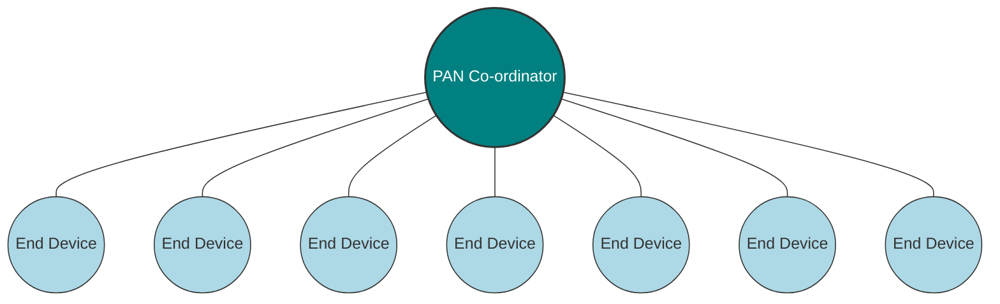
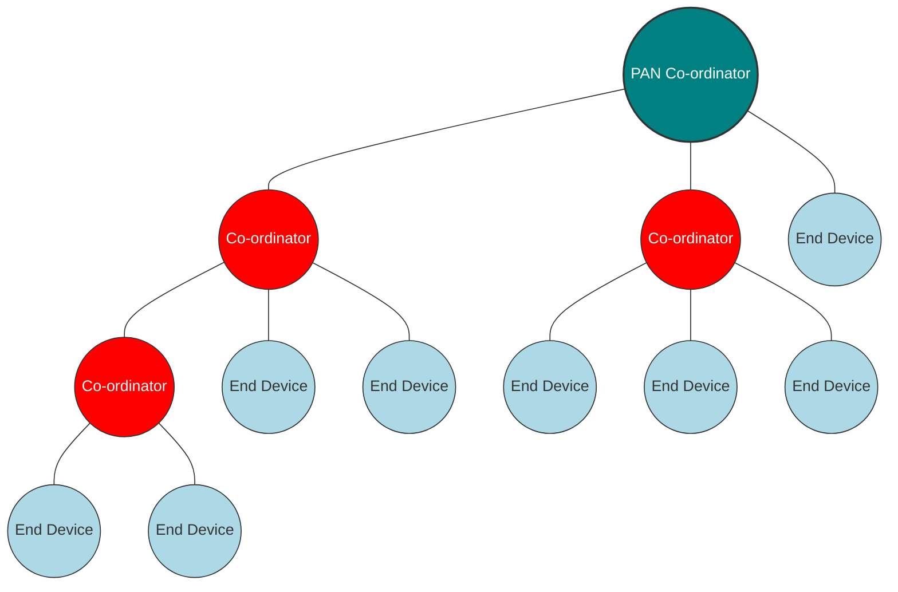

---
tags:
  - CSE_122
---
# Star and Tree Topologies 
In each, there is a central node that is called the **PAN Coordinator**.
- receives/relays all messages
- most capable and power-intensive

The **tree** topology also has **coordinators** (or routers) which 
- controls clusters
- receives and relays to its children 
- communicates up to parent coordinator

The **end devices** only communicate with a single parent coordinator. These are the least capable and least power intensive. 

Star Topology:

Tree Topology:


# Break and Mesh Networks
Most devices are capable of communicating with multiple neighbors. 
- PRO:
	- devices can communicate over longer distances
	- device failures less likely to collapse the entire network 
- CON:
	- some nodes have to spend more energy communicating
	- network protocol is more complicated to manage routing

```tikz
\begin{document}
\begin{tikzpicture}[
    pan/.style={circle, draw, fill=teal, text=white, minimum size=0.9cm, font=\bfseries\tiny},
    coord/.style={circle, draw, fill=red, minimum size=0.6cm},
    enddev/.style={circle, draw, fill=cyan!30, minimum size=0.6cm, font=\tiny}
]

    % --- X-Y Coordinate Placement ---
    % Central Row
    \node[pan] (PC) at (0,0) {PAN};
    \node[coord] (C2) at (3,0) {};
    \node[coord] (C7) at (6,0) {};
    \node[coord] (C9) at (9,0) {};

    % Top Row
    \node[enddev] (ED1) at (-1,2) {End};
    \node[coord] (C1) at (2,2) {};
    \node[coord] (C6) at (5,2) {};
    \node[coord] (C3) at (8,2) {};

    % Bottom Row
    \node[coord] (C5) at (0.5,-2) {};
    \node[coord] (C4) at (3.5,-2) {};
    \node[coord] (C8) at (6.5,-2) {};
    \node[enddev] (ED2) at (10,-1) {End};

    % --- Connections (The Mesh) ---
    % Primary Hub
    \draw (PC) -- (ED1);
    \draw (PC) -- (C1);
    \draw (PC) -- (C2);
    \draw (PC) -- (C4);
    \draw (PC) -- (C5);

    % Horizontal/Outer Links
    \draw (ED1) -- (C1);
    \draw (C1) -- (C6);
    \draw (C6) -- (C3);
    \draw (C3) -- (C9);
    \draw (C9) -- (ED2);
    \draw (ED2) -- (C8);
    \draw (C8) -- (C4);
    \draw (C4) -- (C5);

    % Vertical/Diagonal Cross-Links (Planar)
    \draw (C1) -- (C2);
    \draw (C2) -- (C6);
    \draw (C7) -- (C2);
    \draw (C7) -- (C6);
    \draw (C7) -- (C3);
    \draw (C7) -- (C8);
    \draw (C7) -- (C9);
    \draw (C8) -- (C9);

\end{tikzpicture}
\end{document}
```

# Modes of Operation
- Beacon-enabled PAN 
	- Slotted CSMA/CA
		- Have data to send
		- Wait for next backoff slot (synchronized from beacon)
		- Listen for two empty slots. If idle, then transmit. Otherwise wait for 0-15 backoff slots and repeat.
	- Structured communication patterns
	- Optionally with some TDMA scheduled slots
	- Beacons occur every 15 ms to 245 seconds.
	- Energy savings are determined by when the radios are off 
	- There is some communication latency.
> The idea here is that the PAN Coordinator keeps everyone on schedule via beacon and coordinated "slots" where every peripheral can talk. This is also used to synchronize everyone's clocks. For very important data, the optional TDMA (guaranteed time slots GTS) can be used. 
- Non-beacon-enabled PAN
	- Unslotted [[Medium Access Control#Contention-Based Protocols|CSMA/CA]]
		- Have data to send
		- Wait for 0-7 backoff slots
		- Listen, but for any empty slot.
	- No particular structure for communication
		- Could be defined by other specifications, like [[Thread Networks|Thread]] or Zigbee
	- All devices can be identical (no coordinator needed)
	- Requires a custom communication scheme
> Devices will listen before talking. If a device has data, it will listen to the channel. If it's quiet, it sends immediately. Devices do not synchronize. 

# Receiving Messages
The following are two strategies an **End Device** can use depending on the network mode. 

1. Direct Listening
	1. Listen during entire contention period
	2. Can immediately respond
2. Polling/Indirect
	1. Request messages from coordinator
	2. Coordinator can include list of devices with pending data in beacon

There are more complicated listening algorithms available. 

## Clear Channel Assessment (CCA)
This is the *listen* part of [[Medium Access Control#Contention-Based Protocols|CSMA/CA]]. There are many implementations, such as:
1. Energy above threshold? [[RSSI]]
2. Carrier present? Valid 802.15.4 carrier signal
3. Energy AND/OR Carrier 

