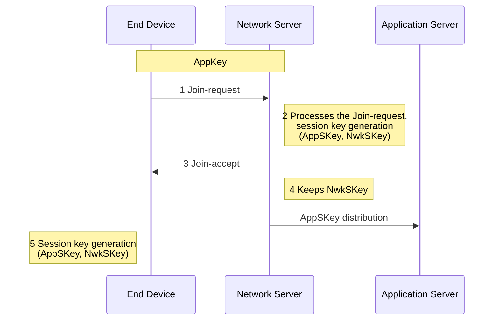

---
tags:
  - CSE_122
---
# LoRa vs. LoRaWAN
- [[LoRa]]: physical layer protocol
- LoRaWAN: MAC and network layer
In practice, LoRa means both. 

# MAC
Uplink is done via [[Medium Access Control#Contention-Based Protocols|ALOHA]], so transmission in done whenever. Packets are randomly spread across uplink channels to reduce odds of collision. Devices using different spreading factors in the same channel do not collide. However, packets are very long. 

There are three classes:
- Class **A** device: listen-after-send, two windows for RX on different channels
- Class **B** device: periodic listening, 2 RX windows after TX, and is synchronized with periodic beacons
- Class **C** device: continuous listening, always on receivers

# Packet Format
```
Physical Layer
+----------+----------------------+-----------------------------+-------------+
| Preamble | Header + Header CRC  |         PHY Payload         | Payload CRC |
|          |      (20 bits)       |           P bytes           |  (16 bits)  |
+----------+----------------------+-----------------------------+-------------+
                               /                                 \
                          /                                       \
MAC Layer           /                                              \
                  +------------+-----------------------+------------+
                  | MAC Header |      MAC Payload      |    MIC     |
                  |   1 byte   |        M bytes        |  4 bytes   |
                  +------------+-----------------------+------------+
                               /                        \
                        /                                  \
Application     /                                            \
Layer          +--------------+------------+------------------+
               | Frame Header | Frame Port |  Frame Payload   |
               | 7 ~ 22 byte  |  1 bytes   |     N bytes      |
               +--------------+------------+------------------+
```
Frame header includes device address. The MAC payload maximum size depends on data rate. 

|**Data Rate Index**|**MAC Payload Size**|
|---|---|
|0|19 bytes|
|1|61 bytes|
|2|133 bytes|
|3|250 bytes|
|4|250 bytes|
LoRaWAN uses a star-of-stars [[Network Topologies#Star and Tree Topologies|topology]]. Abstractly, we can think of a LoRaWAN service as 
```
air quality monitor {} -> LoRaWAN network -> application server []
```

# Joining a LoRaWAN Network 
**Activation By Personalization** (ABP) is a legacy approach with pre-shared security keys. 

**Over The Air Activation** (OTAA) is a dynamic join procedure that sets up security keys. A device knows three things:
1. **AppEUI**: identifier for the application the device uses on the application server
2. **DevEUI**: device ID
3. **AppKey**: AES-128 bit secret registered with the network server 

- The device sends 
  $$
  (\text{AppEUI, DevEUI, Nonce}) + \text{MIC}
  $$
  using the AppKey.
- The network server responds with AppNonce encrypted with AppKey
- The device and network server compute the same AppSKey to encrypt all future payloads. This establishes the session.