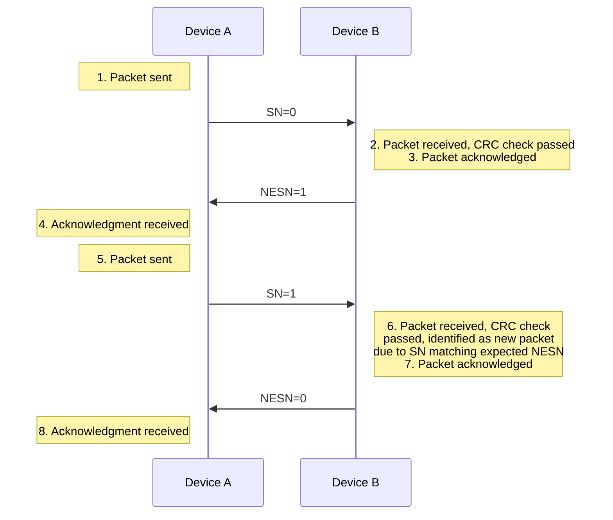
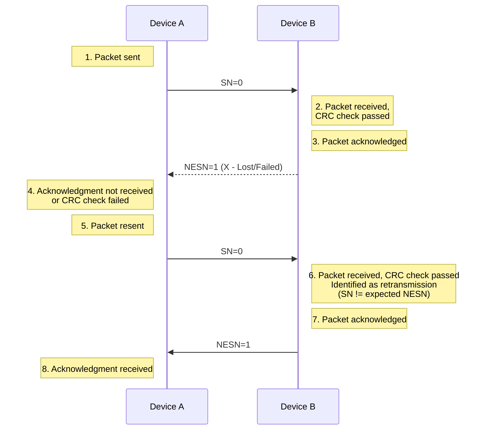
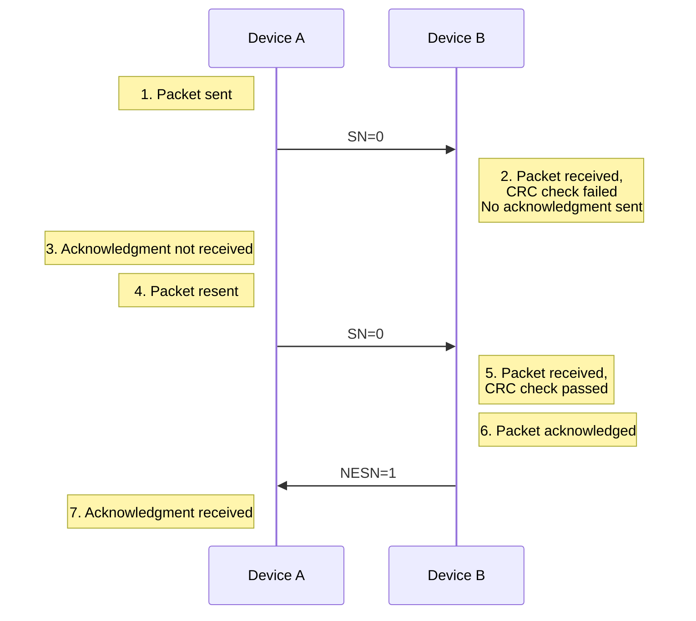

---
tags:
  - CSE_122
---
# Overview
- **Connections** are for bi-directional communication with higher throughput than [[Advertising|advertisements]]. 
	- Half-duplex (one person talks at a time)
	- Typically $1 M\text{sym}/s$ or $1$ mega-[[Symbol|symbol]] per second. Since BLE encodes $1$ bit/symbol, this is $1$ $M$bit/s. PHY has more options after connection.
- A peripheral is either *advertising* or in a *connection*. 
- A central is *scanning* and in one or more connections. 
- This is not actually true; devices can be in many roles simultaneously 

While in a connection, both devices act like servers; either device can read/write fields available on the other device. 

# Choosing a Data Channel for Communication
- Why do you switch from advertising channel to data channel?
	- For better reliability and to improve quality of service
- How to pick a channel out of the 37 data channels?
	- Randomize for reduced chance of collision
- What if two pairs pick same channel?
	- Higher chance of collision occurring
	- Some way to not be tied to the same data channel is needed

# Frequency Hopping Spread Spectrum (FHSS)
- Connected devices hop through channels to improve reliability
- Recall each channel is $2$ MHz wide and there are $40$ channels. Three are used for advertising. So, frequency hopping follows
  $$
  f_{n+1} = (f_{n} + \text{hop}) \bmod 37
  $$
- Which exact channels are used and in what order might vary.
- For a hopping to be successful, both central/peripheral must agree on 
	- Follow same hop sequence (which channels to use and order to follow)
	- Hop at a given time schedule
	- Agree on when to schedule their first communication
- Some synchronization is needed!
- This information is sent on the `CONNECT_REQ` packet. See [[Advertising#Advertisement Packet Layering]]. In particular, this in the LLData of the Payload.

LLData:

| **Name**  | **Size**   |
| --------- | ---------- |
| AA        | $4$ octets |
| CRCInit   | $3$ octets |
| WinSize   | $1$ octet  |
| WinOffset | $2$ octets |
| Interval  | $2$ octets |
| Latency   | $2$ octets |
| Timeout   | $2$ octets |
| ChM       | $5$ octets |
| Hop       | $5$ bits   |
| SCA       | $3$ bits   |
# Connection Timing
BLE Connections happen on a **Connection Interval**. Some data is exchanged at each interval:
- acknowledgements
- additional packets can be sent if there is a lot to transmit
- Each interval is on the next channel in the hopping sequence, i.e. on the next interval, we use the next interval.
- Peripheral can skip a number of intervals to save energy, as defined in `Latency` connection request parameter of the `CONNECT_REQ` -> `LLData` -> `Latency`.
- These connection "events" happen at periodic intervals. 

## How do we schedule the very first connection event?
- **WinOffset**: Time from now until first event. "Let's meet $2$ hours from now!"
- **WinSize**: Flexible window of time to expect first transmission. "I might be up to $15$ minutes late."
This is like an "anchor" for the [[Medium Access Control#Contention-Based Protocols|TDMA schedule]] for this device. 

## How do you agree on hopping pattern?
Use the `ChM` and `Hop` to define the FHSS pattern.
- **ChM**: Map of which channels to use 
- **Hop**: next hop increment. See [[#Frequency Hopping Spread Spectrum (FHSS)]] modulo formula.

# Ensuring Reliability
Connection Messages are **sequenced** for additional reliability. We can see this in the header of the PDU. 

| Field Name | Size     |
| ---------- | -------- |
| LLID       | $2$ bits |
| NESN       | $1$ bit  |
| SN         | $1$ bit  |
| MD         | $1$ bit  |
| RFU        | $3$ bits |
| Length     | $8$ bits |
- In the header of the [[Advertising#Advertisement Packet Layering|PDU]], there are two fields:
	- **NESN**: Next Expected Sequence Number
	- **SN**: Sequence Number 

An example of a successful acknowledgment. Sometimes we fail.

## Scenario 1: Lost Acknowledgment or CRC Failure on ACK
In this case, Device $B$ receives the packet and validates the [[Bluetooth Low Energy#Packet Structure|CRC]]. However, Device $A$ did not receive it or CRC failed.

## Scenario 2: CRC Check Fail on Initial Packet
Here, $B$ receives the packet, but the CRC validation failed. It sends no acknowledgment to $A$. 

## Link Layer ID
The LLID of the header tells the peripheral the control payload. There are many but some examples are:
- request update to connection parameters like interval (by peripheral)
- begin encrypting communication
- terminate a connection `LL_TERMINATE_IND`
These are all handled by the link layer and not passed up. 

## Timeout Field
The timeout field is how long since hearing from a device before the connection breaks. 

Although [[#Link Layer ID]] has a terminate control, this field is useful in case if a device just wanders away, or is shut off, reprogrammed, etc.

# Connection Performance
We care about *robustness*, *performance*, and *scalability*. 
- Only the central needs to know the whole schedule of every peripheral. Central sends first packet at each connection interval to synchronize each peripheral. 
- The BLE specification describes how a peripheral must "widen" its listening window based on *Source Clock Accuracy*. I.e. the clock may drift, so widening ensures it will still receive the packet
  $$
  \text{window\_{widening}} = \left(
  \frac{\text{central\_{SCA}} + \text{peripheral}\_{SCA}}{10^{6}} 
  \right)
  \cdot \text{time\_{since}\_{last}\_{anchor}}
  $$
- We can schedule with granularity of at least $1.25$ ms, so $\geq 800$ devices per second. 
- Since intervals can go up to $4$ seconds, we can have $\geq 3200$ devices per max interval. 
- Central can skip intervals without dropping the connection $\implies$ more granularity.
- So many thousands of devices (although we are sending the minimum-sized packet each time)
- The limit is much lower on real devices.
	- often done in firmware
	- limited by memory and complexity

Even though PHY can support $1$ Mbps, the actual maximum throughput is much lower. If we
- decrease connection interval as much as possible (iOS: $15$ ms, Android: $7.5$ ms)
- increase to the maximum packet size
- use the Data Length Extension (DLE) in BLE v4.2+
we only get $488$ bytes of useful data per connection event. Thus, we get 
$$
520 \text{ kbps} = \text{65 kB/s}
$$
In practice it's lower due to *lost packets*.