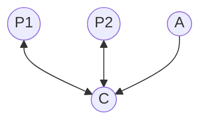

---
tags:
  - CSE_122
---
# Network Topology 
There are two devices, **Peripheral** and **Central/Scanner**. There are also **advertisers**, but when connected they become peripherals. 

This is a simplification. A single device can have multiple roles simultaneously. 
- Scan + Advertise
- Peripheral + Scanner + Advertise
- Peripheral + Scan + Central + Advertise 

One peripheral can also be connected to multiple centrals. 

# BLE Layers
There are three main layers:
- **Host**: Configuration and Server
	- **GAP**: Generic Access Profile. This is where we configure advertising. 
	- **GATT**: Generic ATTribute Profile. This is where we configure connections between devices.
- **HCI**: Host Controller Interface 
	- In the chip there, is a CPU, BLE chip, microcontroller, etc. The HCI is so then the chip can talk to other components inside itself.
- **Controller**: Communication 
	- Link Layer: sending packets
	- RF and PHY: sending bits
Finally, the application sits on top of this stack. This layout is ordered form high level to low level. 

BLE runs of 2.4 GHz with forty 2-MHz channels at up to 1 Mbps data rate. 
- 37, 38, 39 are for advertising 
- 0-36 are for connections. 
Although BLE runs on the same frequency as WiFi, there are techniques to avoid interference. 


# BLE Modulation 
**Gaussian Frequency-Shit Keyring** (GFSK) 
- improvement on [[Signal Qualities#Frequency-shift Keyring (FSK)|FSK]] 
- smoother transitions between bits $\to$ reduce nearby interference
- lessens spectral leakage at the expense of some loss in [[Symbol|intersymbol]] discriminability
	- i.e. reduce bandwidth at the cost of bit errors

# Packet Structure 
```
Preamble                  1 Byte
AccessAddress             4 Bytes
Protocol Data Unit (PDU)  2-257 Bytes
CRC                       3 Bytes
```
- The same packet structure is used for both advertisements and connections.
- Fields are *little endian*. 
- [[Advertising#Advertisement Packet Layering|Advertisement]] packets use fixed Access Address: `0x8E89BED6`
- Established connections use a (randomly chosen) unique Access Address
	- not actually random, just has a bit pattern to not look too much like noise. 

# Data Whitening 
This is a technique to avoid long series of repetitive bits (all zeroes or all ones). In particular, you want a signal to have an equal distribution of $1$s and $0$s. Otherwise, it would imply something has gone wrong. RF noise should not be more focused in one direction. 

Thus, radio hardware outputs with zero bias (or close to it).
